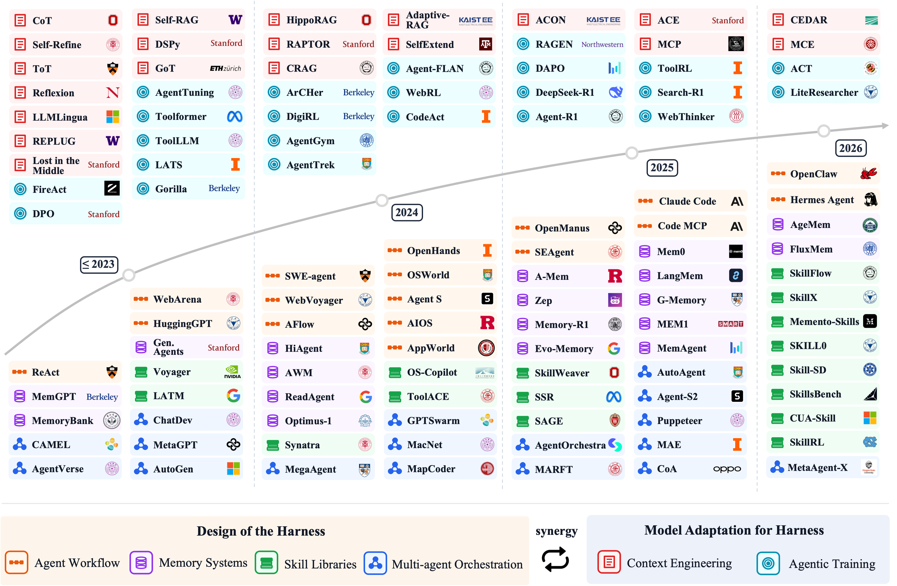
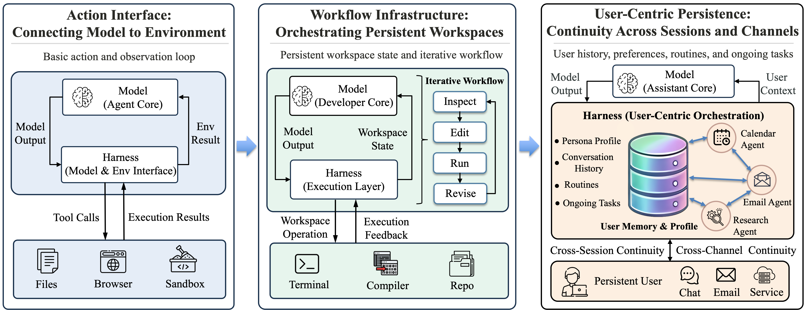

# Agent Systems with Harness Engineering

<p align="center">
  <strong>A Curated Reading List and Structured Roadmap</strong>
</p>

<p align="center">
  <a href="paper/Agent_Systems_with_Harness_Engineering__A_Systematic_Survey.pdf"></a>
  <a href="https://openreview.net/forum?id=nM5tDHrQsx"></a>
  <a href="#"></a>
  <a href="#"></a>
  <a href="#"></a>
  <a href="./LICENSE"></a>
</p>

A curated list of papers and resources on agent systems with harness engineering, based on our survey:<br>
[<u>"Agent Systems with Harness Engineering: A Systematic Survey"</u>](./paper/Agent_Systems_with_Harness_Engineering__A_Systematic_Survey.pdf).

<p align="center">
  
</p>

<p align="center"><em>Timeline of agent systems with harness engineering.</em></p>

> **Tip:** If you have any questions for our paper, please send an email to [txy20010310@163.com](mailto:txy20010310@163.com).

## Table of Contents

- [1. Evolution of Harness Engineering](#1-evolution-of-harness-engineering)
- [2. The Design of the Harness](#2-the-design-of-the-harness)
- [3. Model Adaptation for Harness](#3-model-adaptation-for-harness)
- [4. Representative Benchmarks by Task Domain](#4-representative-benchmarks-by-task-domain)
- [5. Future Directions](#5-future-directions)
- [Citation](#citation)

## 1. Evolution of Harness Engineering

<p align="center">
  
</p>

<p align="center"><em>Three layers in the evolution of harness architecture.</em></p>

### 1.1. Action Interface: Connecting Model to Environment
1. Quine: Realizing LLM Agents as Native POSIX Processes. [[Paper]](https://arxiv.org/abs/2603.18030) `arXiv 2026`
1. ceLLMate: Sandboxing Browser AI Agents. [[Paper]](https://doi.org/10.48550/arXiv.2512.12594) `arXiv 2025`
1. Executable Code Actions Elicit Better LLM Agents. [[Paper]](https://proceedings.mlr.press/v235/wang24h.html) `ICML 2024`
1. DeepAgent: A General Reasoning Agent with Scalable Toolsets. [[Paper]](https://doi.org/10.48550/arXiv.2510.21618) `arXiv 2025`
1. ReAct: Synergizing Reasoning and Acting in Language Models. [[Paper]](https://arxiv.org/pdf/2210.03629.pdf) [[Code]](https://github.com/ysymyth/ReAct) `ICLR 2023`
1. Toolformer: Language Models Can Teach Themselves to Use Tools. [[Paper]](https://arxiv.org/pdf/2302.04761.pdf) `NeurIPS 2023`
1. Tool learning with large language models: a survey. [[Paper]](https://doi.org/10.1007/s11704-024-40678-2) `FCS 2025`
1. AIOS: LLM Agent Operating System. [[Paper]](https://arxiv.org/abs/2403.16971) `COLM 2025`
### 1.2. Workflow Infrastructure: Orchestrating Persistent Workspaces
1. SWE-agent: Agent-Computer Interfaces Enable Automated Software Engineering. [[Paper]](https://arxiv.org/pdf/2405.15793.pdf) [[Code]](https://github.com/princeton-nlp/SWE-agent) `NeurIPS 2024`
1. Engineering Pitfalls in AI Coding Tools: An Empirical Study of Bugs in Claude Code, Codex, and Gemini CLI. [[Paper]](https://arxiv.org/abs/2603.20847) `arXiv 2026`
1. Building Effective AI Coding Agents for the Terminal: Scaffolding, Harness, Context Engineering, and Lessons Learned. [[Paper]](https://doi.org/10.48550/arXiv.2603.05344) `arXiv 2026`
1. SWE-Master: Unleashing the Potential of Software Engineering Agents via Post-Training. [[Paper]](https://arxiv.org/abs/2602.03411) `arXiv 2026`
1. VeRO: An Evaluation Harness for Agents to Optimize Agents. [[Paper]](https://arxiv.org/abs/2602.22480) `ICML 2026`
1. OpenHands: An Open Platform for AI Software Developers as Generalist Agents. [[Paper]](https://openreview.net/forum?id=OJd3ayDDoF) `ICLR 2025`
1. Claude Code Overview. [[Docs]](https://docs.claude.com/en/docs/claude-code/overview) `Docs 2026`
### 1.3. User-Centric Persistence: Continuity Across Sessions and Channels
1. Toward Personalized LLM-Powered Agents: Foundations, Evaluation, and Future Directions. [[Paper]](https://arxiv.org/abs/2602.22680) `arXiv 2026`
1. Enabling Personalized Long-term Interactions in LLM-based Agents through Persistent Memory and User Profiles. [[Paper]](https://doi.org/10.48550/arXiv.2510.07925) `arXiv 2025`
1. User Preference Modeling for Conversational LLM Agents: Weak Rewards from Retrieval-Augmented Interaction. [[Paper]](https://arxiv.org/abs/2603.20939) `arXiv 2026`
1. From Human Memory to AI Memory: A Survey on Memory Mechanisms in the Era of LLMs. [[Paper]](https://doi.org/10.48550/arXiv.2504.15965) `arXiv 2025`
1. Persistent Assistant: Seamless Everyday AI Interactions via Intent Grounding and Multimodal Feedback. [[Paper]](https://doi.org/10.1145/3706598.3714317) `CHI 2025`
1. Introducing OpenClaw. [[Blog]](https://openclaw.ai/blog/introducing-openclaw) `Blog 2026`

## 2. The Design of the Harness

### 2.1. Agent Workflow
1. HuggingGPT: Solving AI Tasks with ChatGPT and its Friends in Hugging Face. [[Paper]](https://arxiv.org/abs/2303.17580) [[Code]](https://github.com/microsoft/JARVIS) `NeurIPS 2023`
1. OpenManus: An Open-source Framework for Building General AI Agents. [[Code]](https://github.com/FoundationAgents/OpenManus) `Repo 2025`
1. Unrolling the Codex agent loop. [[Blog]](https://openai.com/zh-Hans-CN/index/unrolling-the-codex-agent-loop/) `Blog 2026`
1. OpenClaw. [[Code]](https://github.com/openclaw/openclaw) [[Website]](https://openclaw.ai/) `Repo 2026`
1. Hermes Agent. [[Website]](https://hermes-agent.org/) `Website 2026`

#### 2.1.1. Environment Perception

##### Observation Extraction
1. Mind2Web: Towards a Generalist Agent for the Web. [[Paper]](https://arxiv.org/pdf/2306.06070) [[Code]](https://github.com/OSU-NLP-Group/Mind2Web) `NeurIPS 2023`
1. WebArena: A Realistic Web Environment for Building Autonomous Agents. [[Paper]](https://arxiv.org/pdf/2307.13854) [[Code]](https://github.com/web-arena-x/webarena) `ICLR 2024`
1. WebVoyager: Building an End-to-End Web Agent with Large Multimodal Models. [[Paper]](https://arxiv.org/pdf/2401.13919.pdf) [[Code]](https://github.com/MinorJerry/WebVoyager) `ACL 2024`
1. VisualWebArena: Evaluating Multimodal Agents on Realistic Visual Web Tasks. [[Paper]](https://arxiv.org/pdf/2401.13649) [[Code]](https://github.com/web-arena-x/visualwebarena) `ACL 2024`
1. GPT-4V(ision) is a Generalist Web Agent, if Grounded. [[Paper]](https://proceedings.mlr.press/v235/zheng24e.html) `ICML 2024`
1. SeeClick: Harnessing GUI Grounding for Advanced Visual GUI Agents. [[Paper]](https://aclanthology.org/2024.acl-long.505/) `ACL 2024`
1. OSWorld: Benchmarking Multimodal Agents for Open-Ended Tasks in Real Computer Environments. [[Paper]](https://arxiv.org/pdf/2404.07972) [[Code]](https://github.com/xlang-ai/OSWorld) `NeurIPS 2024`
1. DigiRL: Training In-The-Wild Device-Control Agents with Autonomous Reinforcement Learning. [[Paper]](https://arxiv.org/abs/2406.11896) [[Code]](https://github.com/DigiRL-agent/digirl) `NeurIPS 2024`
1. AgentOccam: A Simple Yet Strong Baseline for LLM-Based Web Agents. [[Paper]](https://openreview.net/forum?id=oWdzUpOlkX) `ICLR 2025`
1. Agent S: An Open Agentic Framework that Uses Computers Like a Human. [[Paper]](https://arxiv.org/pdf/2410.08164.pdf) [[Code]](https://github.com/simular-ai/Agent-S) `ICLR 2025 Workshop`
1. AndroidWorld: A Dynamic Benchmarking Environment for Autonomous Agents. [[Paper]](https://arxiv.org/pdf/2405.14573) [[Code]](https://github.com/google-research/android_world) `ICLR 2025`
1. GUI-Actor: Coordinate-Free Visual Grounding for GUI Agents. [[Paper]](https://arxiv.org/pdf/2506.03143v1.pdf) [[Code]](https://github.com/microsoft/GUI-Actor) `NeurIPS 2025`
1. VAGEN: Reinforcing World Model Reasoning for Multi-Turn VLM Agents. [[Paper]](https://arxiv.org/abs/2510.16907) `NeurIPS 2025`

##### State Representation
1. ToolLLM: Facilitating Large Language Models to Master 16000+ Real-world APIs. [[Paper]](https://arxiv.org/pdf/2307.16789) [[Code]](https://github.com/OpenBMB/ToolBench) `ICLR 2024`
1. WebArena: A Realistic Web Environment for Building Autonomous Agents. [[Paper]](https://arxiv.org/pdf/2307.13854) [[Code]](https://github.com/web-arena-x/webarena) `ICLR 2024`
1. SWE-agent: Agent-Computer Interfaces Enable Automated Software Engineering. [[Paper]](https://arxiv.org/pdf/2405.15793.pdf) [[Code]](https://github.com/princeton-nlp/SWE-agent) `NeurIPS 2024`
1. Do LLMs Build World Representations? Probing Through the Lens of State Abstraction. [[Paper]](https://proceedings.neurips.cc/paper_files/paper/2024/file/b1b16c4b875eb84d3585cb70d23970ca-Paper-Conference.pdf) [[Code]](https://github.com/BorealisAI/llm-world-abs) `NeurIPS 2024`
1. AgentOccam: A Simple Yet Strong Baseline for LLM-Based Web Agents. [[Paper]](https://openreview.net/forum?id=oWdzUpOlkX) `ICLR 2025`
1. AgentTrek: Agent Trajectory Synthesis via Guiding Replay with Web Tutorials. [[Paper]](https://arxiv.org/abs/2412.09605) [[Code]](https://agenttrek.github.io/) `ICLR 2025`
1. GRAPHGPT-O: Synergistic Multimodal Comprehension and Generation on Graphs. [[Paper]](https://arxiv.org/pdf/2502.11925.pdf) [[Code]](https://github.com/YiFang99/GraphGPT-O) `CVPR 2025`
1. The Complexity Trap: Simple Observation Masking Is as Efficient as LLM Summarization for Agent Context Management. [[Paper]](https://doi.org/10.48550/arXiv.2508.21433) `arXiv 2025`
1. ESCA: Contextualizing Embodied Agents via Scene-Graph Generation. [[Paper]](https://arxiv.org/pdf/2510.15963.pdf) [[Code]](https://github.com/video-fm/ESCA) `NeurIPS 2025`
1. Evaluating LLM Planning in Partially Observable Environments via Observation Representations and Action Sequences. [[Paper]](https://openreview.net/forum?id=bCKBuMKxJi) `NeurIPS 2025 Workshop`
1. DynaWeb: Model-Based Reinforcement Learning of Web Agents. [[Paper]](https://doi.org/10.48550/arXiv.2601.22149) `arXiv 2026`
1. Building a C compiler with a team of parallel Claudes. [[Blog]](https://www.anthropic.com/engineering/building-c-compiler) `Blog 2026`

#### 2.1.2. Task Planning

##### Task Decomposition
1. Chain-of-Thought Prompting Elicits Reasoning in Large Language Models. [[Paper]](https://arxiv.org/pdf/2201.11903.pdf) [[Code]](https://github.com/google-research/url-nlp/tree/main/mgsm) `NeurIPS 2022`
1. Least-to-Most Prompting Enables Complex Reasoning in Large Language Models. [[Paper]](https://arxiv.org/pdf/2205.10625.pdf) `ICLR 2023`
1. Tree of Thoughts: Deliberate Problem Solving with Large Language Models. [[Paper]](https://arxiv.org/pdf/2305.10601.pdf) [[Code]](https://github.com/princeton-nlp/tree-of-thought-llm) `NeurIPS 2023`
1. Graph of Thoughts: Solving Elaborate Problems with Large Language Models. [[Paper]](https://arxiv.org/pdf/2308.09687.pdf) [[Code]](https://github.com/spcl/graph-of-thoughts) `AAAI 2024`
1. Agentic Reasoning: A Streamlined Framework for Enhancing LLM Reasoning with Agentic Tools. [[Paper]](https://aclanthology.org/2025.acl-long.1383.pdf) `ACL 2025`
1. Agentic Reasoning for Large Language Models. [[Paper]](https://doi.org/10.48550/arXiv.2601.12538) `arXiv 2026`
1. Building a C compiler with a team of parallel Claudes. [[Blog]](https://www.anthropic.com/engineering/building-c-compiler) `Blog 2026`

##### Plan Generation
1. AvaTaR: Optimizing LLM Agents for Tool Usage via Contrastive Reasoning. [[Paper]](https://proceedings.neurips.cc/paper_files/paper/2024/file/2db8ce969b000fe0b3fb172490c33ce8-Paper-Conference.pdf) [[Code]](https://github.com/zou-group/avatar) `NeurIPS 2024`
1. AFlow: Automating Agentic Workflow Generation. [[Paper]](https://arxiv.org/abs/2410.10762) [[Code]](https://github.com/FoundationAgents/AFlow) `ICLR 2025`
1. GAP: Graph-Based Agent Planning with Parallel Tool Use and Reinforcement Learning. [[Paper]](https://openreview.net/pdf?id=7bJIVHEvLm) [[Code]](https://github.com/WJQ7777/Graph-Agent-Planning) `arXiv 2025`

#### 2.1.3. Action Execution

##### Tool Invocation
1. Toolformer: Language Models Can Teach Themselves to Use Tools. [[Paper]](https://arxiv.org/pdf/2302.04761.pdf) `NeurIPS 2023`
1. Code as Policies: Language Model Programs for Embodied Control. [[Paper]](https://arxiv.org/pdf/2209.07753.pdf) [[Code]](https://github.com/google-research/google-research/tree/master/code_as_policies) `ICRA 2023`
1. SWE-agent: Agent-Computer Interfaces Enable Automated Software Engineering. [[Paper]](https://arxiv.org/pdf/2405.15793.pdf) [[Code]](https://github.com/princeton-nlp/SWE-agent) `NeurIPS 2024`
1. AppWorld: A Controllable World of Apps and People for Benchmarking Interactive Coding Agents. [[Paper]](https://arxiv.org/pdf/2407.18901) [[Code]](https://github.com/StonyBrookNLP/appworld) `ACL 2024`
1. Code execution with MCP: building more efficient AI agents. [[Blog]](https://www.anthropic.com/engineering/code-execution-with-mcp) `Blog 2025`
1. Agent0-VL: Exploring Self-Evolving Agent for Tool-Integrated Vision-Language Reasoning. [[Paper]](https://arxiv.org/abs/2511.19900) `arXiv 2025`
1. Scaling Agentic Reinforcement Learning for Tool-Integrated Reasoning in VLMs. [[Paper]](https://arxiv.org/abs/2511.19773) `arXiv 2025`
1. Robust Tool Use via Fission-GRPO: Learning to Recover from Execution Errors. [[Paper]](https://arxiv.org/abs/2601.15625) `arXiv 2026`

##### Environment Interaction
1. ReAct: Synergizing Reasoning and Acting in Language Models. [[Paper]](https://arxiv.org/pdf/2210.03629.pdf) [[Code]](https://github.com/ysymyth/ReAct) `ICLR 2023`
1. SWE-agent: Agent-Computer Interfaces Enable Automated Software Engineering. [[Paper]](https://arxiv.org/pdf/2405.15793.pdf) [[Code]](https://github.com/princeton-nlp/SWE-agent) `NeurIPS 2024`
1. Grounding Multimodal Large Language Models in Actions. [[Paper]](https://proceedings.neurips.cc/paper_files/paper/2024/file/2406694fd7bc7e7bf257446a14f9ea63-Paper-Conference.pdf) `NeurIPS 2024`
1. ceLLMate: Sandboxing Browser AI Agents. [[Paper]](https://doi.org/10.48550/arXiv.2512.12594) `arXiv 2025`
1. Agent-Fence: Mapping Security Vulnerabilities Across Deep Research Agents. [[Paper]](https://arxiv.org/abs/2602.07652) `arXiv 2026`
1. Quine: Realizing LLM Agents as Native POSIX Processes. [[Paper]](https://arxiv.org/abs/2603.18030) `arXiv 2026`

### 2.2. Memory Systems

#### 2.2.1. Short-term Memory

##### Working Memory
1. ReAct: Synergizing Reasoning and Acting in Language Models. [[Paper]](https://arxiv.org/pdf/2210.03629.pdf) [[Code]](https://github.com/ysymyth/ReAct) `ICLR 2023`
1. ReadAgent: A Human-Inspired Reading Agent with Gist Memory of Very Long Contexts. [[Paper]](https://arxiv.org/abs/2402.09727) [[Code]](https://github.com/read-agent/read-agent.github.io) `ICML 2024`
1. Agent Workflow Memory. [[Paper]](https://arxiv.org/pdf/2409.07429) [[Code]](https://github.com/zorazrw/agent-workflow-memory) `ICML 2025`
1. Understanding Software Engineering Agents: A Study of Thought-Action-Result Trajectories. [[Paper]](https://doi.org/10.1109/ASE63991.2025.00234) `ASE 2025`
1. Memo: Training Memory-Efficient Embodied Agents with Reinforcement Learning. [[Paper]](https://arxiv.org/pdf/2510.19732.pdf) [[Code]](https://github.com/gunshi/memo) `NeurIPS 2025`
1. Managing Context on the Claude Developer Platform. [[Blog]](https://www.anthropic.com/news/context-management) `Blog 2025`
1. Graph-based Agent Memory: Taxonomy, Techniques, and Applications. [[Paper]](https://doi.org/10.48550/arXiv.2602.05665) `arXiv 2026`

##### Conversational Memory
1. MemGPT: Towards LLMs as Operating Systems. [[Paper]](https://arxiv.org/pdf/2310.08560) [[Code]](https://research.memgpt.ai/) `arXiv 2023`
1. Zep: A Temporal Knowledge Graph Architecture for Agent Memory. [[Paper]](https://doi.org/10.48550/arXiv.2501.13956) `arXiv 2025`
1. From Isolated Conversations to Hierarchical Schemas: Dynamic Tree Memory Representation for LLMs. [[Paper]](https://openreview.net/forum?id=moXtEmCleY) `ICLR 2025`
1. SeCom: On Memory Construction and Retrieval for Personalized Conversational Agents. [[Paper]](https://openreview.net/forum?id=xKDZAW0He3) `ICLR 2025`
1. Hello Again! LLM-powered Personalized Agent for Long-term Dialogue. [[Paper]](https://aclanthology.org/2025.naacl-long.272/) `NAACL 2025`
1. SGMem: Sentence Graph Memory for Long-Term Conversational Agents. [[Paper]](https://doi.org/10.48550/arXiv.2509.21212) `arXiv 2025`
1. Managing Context on the Claude Developer Platform. [[Blog]](https://www.anthropic.com/news/context-management) `Blog 2025`
1. Agentic Memory: Learning Unified Long-Term and Short-Term Memory Management for Large Language Model Agents. [[Paper]](https://doi.org/10.48550/arXiv.2601.01885) `arXiv 2026`
1. From Single to Multi-Granularity: Toward Long-Term Memory Association and Selection of Conversational Agents. [[Paper]](https://openreview.net/forum?id=i2yIvZARnG) `ICLR 2026`
1. FluxMem: Adaptive Hierarchical Memory for Streaming Video Understanding. [[Paper]](https://arxiv.org/abs/2603.02096) `CVPR 2026`

#### 2.2.2. Long-term Memory
1. Memory Overview. [[Docs]](https://docs.langchain.com/oss/python/concepts/memory) `Docs 2026`
1. LangMem. [[Docs]](https://langchain-ai.github.io/langmem/) `Docs 2026`

##### Structured Memory
1. Generative Agents: Interactive Simulacra of Human Behavior. [[Paper]](https://dl.acm.org/doi/epdf/10.1145/3586183.3606763) [[Code]](https://github.com/joonspk-research/generative_agents) `UIST 2023`
1. Optimus-1: Hybrid Multimodal Memory Empowered Agents Excel in Long-Horizon Tasks. [[Paper]](https://arxiv.org/abs/2408.03615) [[Code]](https://github.com/iLearn-Lab/NeurIPS24-Optimus-1) `NeurIPS 2024`
1. A-Mem: Agentic Memory for LLM Agents. [[Paper]](https://arxiv.org/pdf/2502.12110) [[Code]](https://github.com/WujiangXu/A-mem) `NeurIPS 2025`
1. Bridging Intuitive Associations and Deliberate Recall: Empowering LLM Personal Assistant with Graph-Structured Long-term Memory. [[Paper]](https://aclanthology.org/2025.findings-acl.901/) `Findings of ACL 2025`
1. CarMem: Enhancing Long-Term Memory in LLM Voice Assistants through Category-Bounding. [[Paper]](https://aclanthology.org/2025.coling-industry.29/) `COLING 2025`
1. Mem0: Building Production-Ready AI Agents with Scalable Long-Term Memory. [[Paper]](https://arxiv.org/pdf/2504.19413) [[Code]](https://mem0.ai/research) `ECAI 2025`
1. G-Memory: Tracing Hierarchical Memory for Multi-Agent Systems. [[Paper]](https://openreview.net/pdf?id=mmIAp3cVS0) [[Code]](https://github.com/bingreeky/GMemory) `NeurIPS 2025`
1. Graph-Native Cognitive Memory for AI Agents: Formal Belief Revision Semantics for Versioned Memory Architectures. [[Paper]](https://arxiv.org/abs/2603.17244) `arXiv 2026`

##### Unstructured Memory
1. MemGPT: Towards LLMs as Operating Systems. [[Paper]](https://arxiv.org/pdf/2310.08560) [[Code]](https://research.memgpt.ai/) `arXiv 2023`
1. Reflexion: language agents with verbal reinforcement learning. [[Paper]](https://arxiv.org/abs/2303.11366) [[Code]](https://github.com/noahshinn/reflexion) `NeurIPS 2023`
1. MemoryBank: Enhancing Large Language Models with Long-Term Memory. [[Paper]](https://arxiv.org/pdf/2305.10250.pdf) [[Code]](https://github.com/zhongwanjun/MemoryBank-SiliconFriend) `AAAI 2024`
1. Memory-R1: Enhancing Large Language Model Agents to Manage and Utilize Memories via Reinforcement Learning. [[Paper]](https://doi.org/10.48550/arXiv.2508.19828) [[Code]](https://github.com/yansikuan/memory-r1/) `arXiv 2025`
1. MOOM: Maintenance, Organization and Optimization of Memory in Ultra-Long Role-Playing Dialogues. [[Paper]](https://doi.org/10.48550/arXiv.2509.11860) `arXiv 2025`
1. O-Mem: Omni Memory System for Personalized, Long Horizon, Self-Evolving Agents. [[Paper]](https://arxiv.org/abs/2511.13593) `arXiv 2025`
1. General Agentic Memory Via Deep Research. [[Paper]](https://arxiv.org/abs/2511.18423) `arXiv 2025`
1. Evo-Memory: Benchmarking LLM Agent Test-time Learning with Self-Evolving Memory. [[Paper]](https://arxiv.org/abs/2511.20857) [[Code]](https://github.com/zhaosnw/evo_mem) `arXiv 2025`
1. MEM1: Learning to Synergize Memory and Reasoning for Efficient Long-Horizon Agents. [[Paper]](https://arxiv.org/abs/2506.15841) [[Code]](https://github.com/microsoft/MEM1) `ICLR 2026`
1. MemAgent: Reshaping Long-Context LLM with Multi-Conv RL-based Memory Agent. [[Paper]](https://arxiv.org/abs/2507.02259) [[Code]](https://github.com/BytedTsinghua-SIA/MemAgent) `ICLR 2026`
1. RetroAgent: From Solving to Evolving via Retrospective Dual Intrinsic Feedback. [[Paper]](https://arxiv.org/abs/2603.08561) `arXiv 2026`
1. Agentic Memory: Learning Unified Long-Term and Short-Term Memory Management for Large Language Model Agents. [[Paper]](https://doi.org/10.48550/arXiv.2601.01885) `arXiv 2026`
1. Mem0: Universal Memory Layer for AI Agents. [[Code]](https://github.com/mem0ai/mem0) `Repo 2026`
1. OpenMemory: AI Memory MCP Server for Coding Agents. [[Website]](https://mem0.ai/openmemory) `Web 2026`
1. Memory - Docs by LangChain. [[Docs]](https://docs.langchain.com/oss/python/deepagents/memory) `Docs 2026`
1. Context Engineering: Memory, Compaction, and Tool Clearing. [[Docs]](https://platform.claude.com/cookbook/tool-use-context-engineering-context-engineering-tools) `Docs 2026`

### 2.3. Skill Libraries
1. SkillsBench: Benchmarking How Well Agent Skills Work Across Diverse Tasks. [[Paper]](https://arxiv.org/abs/2602.12670) [[Code]](https://github.com/benchflow-ai/skillsbench) `arXiv 2026`
1. Memory - Docs by LangChain. [[Docs]](https://docs.langchain.com/oss/python/deepagents/memory) `Docs 2026`
1. SkillX: Automatically Constructing Skill Knowledge Bases for Agents. [[Paper]](https://arxiv.org/abs/2604.04804) `arXiv 2026`

#### 2.3.1. Skill Acquisition

##### Learning from Demonstration
1. Toolformer: Language Models Can Teach Themselves to Use Tools. [[Paper]](https://arxiv.org/pdf/2302.04761.pdf) `NeurIPS 2023`
1. Large Language Models as Tool Makers. [[Paper]](https://arxiv.org/abs/2305.17126) [[Code]](https://github.com/ctlllll/LLM-ToolMaker) `ICLR 2024`
1. Gorilla: Large Language Model Connected with Massive APIs. [[Paper]](http://papers.nips.cc/paper_files/paper/2024/hash/e4c61f578ff07830f5c37378dd3ecb0d-Abstract-Conference.html) `NeurIPS 2024`
1. Voyager: An Open-Ended Embodied Agent with Large Language Models. [[Paper]](https://arxiv.org/pdf/2305.16291.pdf) [[Code]](https://github.com/MineDojo/Voyager) `TMLR 2024`
1. Synatra: Turning Indirect Knowledge into Direct Demonstrations for Digital Agents at Scale. [[Paper]](http://papers.nips.cc/paper_files/paper/2024/hash/a6a6891cf1dfc64d664f086cf5976e93-Abstract-Conference.html) `NeurIPS 2024`
1. ToolACE: Winning the Points of LLM Function Calling. [[Paper]](https://arxiv.org/abs/2409.00920) [[Code]](https://github.com/zuoyifan132/ToolAce) `ICLR 2025`
1. SkillWeaver: Web Agents can Self-Improve by Discovering and Honing Skills. [[Paper]](https://doi.org/10.48550/arXiv.2504.07079) `arXiv 2025`
1. Agent Skill Acquisition for Large Language Models via CycleQD. [[Paper]](https://arxiv.org/pdf/2410.14735.pdf) [[Code]](https://github.com/SakanaAI/CycleQD) `arXiv 2025`
1. Inducing Programmatic Skills for Agentic Tasks. [[Paper]](https://openreview.net/forum?id=lsAY6fWsog) `COLM 2025`
1. SoK: Agentic Skills - Beyond Tool Use in LLM Agents. [[Paper]](https://doi.org/10.48550/arXiv.2602.20867) `arXiv 2026`
1. Agent Skills for Large Language Models: Architecture, Acquisition, Security, and the Path Forward. [[Paper]](https://arxiv.org/abs/2602.12430) `arXiv 2026`
1. SkillCraft: Can LLM Agents Learn to Use Tools Skillfully? [[Paper]](https://arxiv.org/pdf/2603.00718.pdf) [[Code]](https://github.com/shiqichen17/SkillCraft) `arXiv 2026`
1. Trace2Skill: Distill Trajectory-Local Lessons into Transferable Agent Skills. [[Paper]](https://arxiv.org/abs/2603.25158) `arXiv 2026`
1. Go-Browse: Training Web Agents with Structured Exploration. [[Paper]](https://openreview.net/forum?id=IpzRWE52yw) `ICLR 2026`
1. ContractSkill: Repairable Contract-Based Skills for Multimodal Web Agents. [[Paper]](https://arxiv.org/abs/2603.20340) `arXiv 2026`

##### Learning from Experience
1. Hierarchical Reinforcement Learning: A Survey and Open Research Challenges. [[Paper]](https://doi.org/10.3390/make4010009) `MAKE 2022`
1. ExpeL: LLM Agents Are Experiential Learners. [[Paper]](https://arxiv.org/pdf/2308.10144.pdf) [[Code]](https://github.com/LeapLabTHU/ExpeL) `AAAI 2024`
1. OS-Copilot: Towards Generalist Computer Agents with Self-Improvement. [[Paper]](https://arxiv.org/abs/2402.07456) [[Code]](https://github.com/OS-Copilot/OS-Copilot) `ICLR 2024`
1. SEAgent: Self-Evolving Computer Use Agent with Autonomous Learning from Experience. [[Paper]](https://arxiv.org/pdf/2508.04700.pdf) [[Code]](https://github.com/SunzeY/SEAgent) `arXiv 2025`
1. Leveraging Skills from Unlabeled Prior Data for Efficient Online Exploration. [[Paper]](https://arxiv.org/pdf/2410.18076.pdf) [[Code]](https://github.com/rail-berkeley/SUPE) `ICML 2025`
1. Reinforcement Learning for Self-Improving Agent with Skill Library. [[Paper]](https://arxiv.org/abs/2512.17102) [[Code]](https://github.com/amazon-science/SAGE) `arXiv 2025`
1. Toward Training Superintelligent Software Agents through Self-Play SWE-RL. [[Paper]](https://arxiv.org/abs/2512.18552) [[Code]](https://github.com/hehamalainen/SWE-RL-) `ICML 2026`
1. Evolving Programmatic Skill Networks. [[Paper]](https://doi.org/10.48550/arXiv.2601.03509) `arXiv 2026`
1. SkillRL: Evolving Agents via Recursive Skill-Augmented Reinforcement Learning. [[Paper]](https://arxiv.org/pdf/2602.08234.pdf) [[Code]](https://github.com/aiming-lab/SkillRL) `ICLR 2026 Workshop`
1. Tool-R0: Self-Evolving LLM Agents for Tool-Learning from Zero Data. [[Paper]](https://arxiv.org/abs/2602.21320) `arXiv 2026`
1. AutoSkill: Experience-Driven Lifelong Learning via Skill Self-Evolution. [[Paper]](https://arxiv.org/abs/2603.01145) `arXiv 2026`
1. Memento-Skills: Let Agents Design Agents. [[Paper]](https://arxiv.org/abs/2603.18743) `arXiv 2026`
1. ELITE: Experiential Learning and Intent-Aware Transfer for Self-improving Embodied Agents. [[Paper]](https://arxiv.org/abs/2603.24018) `arXiv 2026`
1. SKILL0: In-Context Agentic Reinforcement Learning for Skill Internalization. [[Paper]](https://arxiv.org/abs/2604.02268) [[Code]](https://github.com/ZJU-REAL/SkillZero) `arXiv 2026`
1. Skill-SD: Skill-Conditioned Self-Distillation for Multi-turn LLM Agents. [[Paper]](https://arxiv.org/abs/2604.10674) [[Project]](https://k1xe.github.io/skill-sd/) `arXiv 2026`

##### Learning from External Resources
1. Equipping Agents for the Real World with Agent Skills. [[Blog]](https://www.anthropic.com/engineering/equipping-agents-for-the-real-world-with-agent-skills) `Blog 2025`
1. Agent Skills. [[Docs]](https://platform.claude.com/docs/en/agents-and-tools/agent-skills/overview) `Docs 2025`
1. Skills in OpenAI API. [[Docs]](https://developers.openai.com/cookbook/examples/skills_in_api) `Docs 2026`
1. SKILLFOUNDRY: Building Self-Evolving Agent Skill Libraries from Heterogeneous Scientific Resources. [[Paper]](https://arxiv.org/abs/2604.03964) `arXiv 2026`

#### 2.3.2. Skill Management

##### Skill Representation
1. Voyager: An Open-Ended Embodied Agent with Large Language Models. [[Paper]](https://arxiv.org/pdf/2305.16291.pdf) [[Code]](https://github.com/MineDojo/Voyager) `TMLR 2024`
1. Inducing Programmatic Skills for Agentic Tasks. [[Paper]](https://openreview.net/forum?id=lsAY6fWsog) `COLM 2025`
1. ToolGen: Unified Tool Retrieval and Calling via Generation. [[Paper]](https://arxiv.org/pdf/2410.03439.pdf) [[Code]](https://github.com/Reason-Wang/ToolGen) `ICLR 2025`
1. Equipping Agents for the Real World with Agent Skills. [[Blog]](https://www.anthropic.com/engineering/equipping-agents-for-the-real-world-with-agent-skills) `Blog 2025`
1. SoK: Agentic Skills - Beyond Tool Use in LLM Agents. [[Paper]](https://doi.org/10.48550/arXiv.2602.20867) `arXiv 2026`
1. Evolving Programmatic Skill Networks. [[Paper]](https://doi.org/10.48550/arXiv.2601.03509) `arXiv 2026`
1. CUA-Skill: Develop Skills for Computer Using Agent. [[Paper]](https://arxiv.org/abs/2601.21123) [[Code]](https://github.com/microsoft/cua_skill) `arXiv 2026`
1. Trace2Skill: Distill Trajectory-Local Lessons into Transferable Agent Skills. [[Paper]](https://arxiv.org/abs/2603.25158) `arXiv 2026`
1. Memento-Skills: Let Agents Design Agents. [[Paper]](https://arxiv.org/abs/2603.18743) `arXiv 2026`
1. SkillFlow: Scalable and Efficient Agent Skill Retrieval System. [[Paper]](https://arxiv.org/abs/2504.06188) `arXiv 2026`
1. Graph of Skills: Dependency-Aware Structural Retrieval for Massive Agent Skills. [[Paper]](https://arxiv.org/abs/2604.05333) `arXiv 2026`
1. SkillRouter: Skill Routing for LLM Agents at Scale. [[Paper]](https://arxiv.org/abs/2603.22455) `arXiv 2026`
1. Skills in OpenAI API. [[Docs]](https://developers.openai.com/cookbook/examples/skills_in_api) `Docs 2026`
1. Agent Skills. [[Docs]](https://developers.openai.com/codex/skills) `Docs 2026`

##### Skill Retrieval
1. Voyager: An Open-Ended Embodied Agent with Large Language Models. [[Paper]](https://arxiv.org/pdf/2305.16291.pdf) [[Code]](https://github.com/MineDojo/Voyager) `TMLR 2024`
1. SRSA: Skill Retrieval and Adaptation for Robotic Assembly Tasks. [[Paper]](https://arxiv.org/pdf/2503.04538.pdf) `ICLR 2025`
1. EvolveR: Self-Evolving LLM Agents through an Experience-Driven Lifecycle. [[Paper]](https://arxiv.org/abs/2510.16079) [[Code]](https://github.com/Edaizi/EvolveR) `arXiv 2025`
1. Memento-Skills: Let Agents Design Agents. [[Paper]](https://arxiv.org/abs/2603.18743) `arXiv 2026`
1. IntentCUA: Learning Intent-level Representations for Skill Abstraction and Multi-Agent Planning in Computer-Use Agents. [[Paper]](https://arxiv.org/abs/2602.17049) `arXiv 2026`
1. GraphSkill: Documentation-Guided Hierarchical Retrieval-Augmented Coding for Complex Graph Reasoning. [[Paper]](https://arxiv.org/abs/2603.06620) `arXiv 2026`
1. SkillRouter: Skill Routing for LLM Agents at Scale. [[Paper]](https://arxiv.org/abs/2603.22455) `arXiv 2026`
1. SkillFlow: Scalable and Efficient Agent Skill Retrieval System. [[Paper]](https://arxiv.org/abs/2504.06188) `arXiv 2026`
1. Graph of Skills: Dependency-Aware Structural Retrieval for Massive Agent Skills. [[Paper]](https://arxiv.org/abs/2604.05333) `arXiv 2026`
1. WebXSkill: Skill Learning for Autonomous Web Agents. [[Paper]](https://arxiv.org/abs/2604.13318) `arXiv 2026`
1. Skill Retrieval Augmentation for Agentic AI. [[Paper]](https://arxiv.org/abs/2604.24594) `arXiv 2026`

#### 2.3.3. Skill Maintenance

##### Library Curation
1. Using Skills to Accelerate OSS Maintenance. [[Blog]](https://developers.openai.com/blog/skills-agents-sdk) `Blog 2026`
1. Shell + Skills + Compaction: Tips for Long-Running Agents that Do Real Work. [[Blog]](https://developers.openai.com/blog/skills-shell-tips) `Blog 2026`
1. SkillRouter: Skill Routing for LLM Agents at Scale. [[Paper]](https://arxiv.org/abs/2603.22455) `arXiv 2026`
1. Graph of Skills: Dependency-Aware Structural Retrieval for Massive Agent Skills. [[Paper]](https://arxiv.org/abs/2604.05333) `arXiv 2026`

##### Skill Governance
1. Equipping Agents for the Real World with Agent Skills. [[Blog]](https://www.anthropic.com/engineering/equipping-agents-for-the-real-world-with-agent-skills) `Blog 2025`
1. Skills in OpenAI API. [[Docs]](https://developers.openai.com/cookbook/examples/skills_in_api) `Docs 2026`
1. Testing Agent Skills Systematically with Evals. [[Blog]](https://developers.openai.com/blog/eval-skills) `Blog 2026`
1. Towards Secure Agent Skills: Architecture, Threat Taxonomy, and Security Analysis. [[Paper]](https://arxiv.org/abs/2604.02837) `arXiv 2026`

### 2.4. Multi-agent Orchestration

#### 2.4.1. Coordination Architectures

##### Centralized Architectures
1. ChatDev: Communicative Agents for Software Development. [[Paper]](https://aclanthology.org/2024.acl-long.810.pdf) [[Code]](https://github.com/OpenBMB/ChatDev) `ACL 2024`
1. MetaGPT: Meta Programming for A Multi-Agent Collaborative Framework. [[Paper]](https://openreview.net/pdf?id=VtmBAGCN7o) [[Code]](https://github.com/geekan/MetaGPT) `ICLR 2024`
1. AutoGen: Enabling Next-Gen LLM Applications via Multi-Agent Conversations. [[Paper]](https://openreview.net/pdf?id=BAakY1hNKS) [[Code]](https://github.com/microsoft/autogen) `COLM 2024`
1. AutoAgents: A Framework for Automatic Agent Generation. [[Paper]](https://arxiv.org/pdf/2309.17288) [[Code]](https://github.com/Link-AGI/AutoAgents) `IJCAI 2024`
1. Scaling Large Language Model-based Multi-Agent Collaboration. [[Paper]](https://arxiv.org/abs/2406.07155) [[Code]](https://github.com/OpenBMB/ChatDev/tree/macnet) `ICLR 2025`
1. AutoAgent: A Fully-Automated and Zero-Code Framework for LLM Agents. [[Paper]](https://arxiv.org/abs/2502.05957) [[Code]](https://github.com/HKUDS/AutoAgent) `arXiv 2025`
1. Agent S2: A Compositional Generalist-Specialist Framework for Computer Use Agents. [[Paper]](https://arxiv.org/abs/2504.00906) [[Code]](https://github.com/JaYzZ/Agent-S2) `COLM 2025`
1. MegaAgent: A Large-Scale Autonomous LLM-based Multi-Agent System Without Predefined SOPs. [[Paper]](https://aclanthology.org/2025.findings-acl.259.pdf) [[Code]](https://github.com/Xtra-Computing/MegaAgent) `Findings of ACL 2025`
1. Multi-Agent Collaboration via Evolving Orchestration. [[Paper]](https://arxiv.org/abs/2505.19591) [[Code]](https://github.com/OpenBMB/ChatDev/tree/puppeteer) `NeurIPS 2025`

##### Decentralized Architectures
1. CAMEL: Communicative Agents for "Mind" Exploration of Large Language Model Society. [[Paper]](https://proceedings.neurips.cc/paper/2023/hash/a3621ee907def47c1b952ade25c67698-Abstract-Conference.html) [[Code]](https://github.com/camel-ai/camel) `NeurIPS 2023`
1. AgentVerse: Facilitating Multi-Agent Collaboration and Exploring Emergent Behaviors in Agents. [[Paper]](https://openreview.net/pdf?id=EHg5GDnyq1) [[Code]](https://github.com/OpenBMB/AgentVerse) `arXiv 2023`
1. ProAgent: Building Proactive Cooperative Agents with Large Language Models. [[Paper]](https://ojs.aaai.org/index.php/AAAI/article/view/29710) `AAAI 2024`
1. A Dynamic LLM-Powered Agent Network for Task-Oriented Agent Collaboration. [[Paper]](https://arxiv.org/pdf/2310.02170) [[Code]](https://github.com/SALT-NLP/DyLAN) `COLM 2024`
1. CONSENSAGENT: Towards Efficient and Effective Consensus in Multi-Agent LLM Interactions Through Sycophancy Mitigation. [[Paper]](https://aclanthology.org/2025.findings-acl.1141.pdf) [[Code]](https://github.com/priyapitre/CONSENSAGENT) `Findings of ACL 2025`
1. AgentOrchestra: Orchestrating Multi-Agent Intelligence with the Tool-Environment-Agent(TEA) Protocol. [[Paper]](https://doi.org/10.48550/arXiv.2506.12508) `arXiv 2025`
1. LLM-Driven Multi-Agent Architectures for Intelligent Self-Organizing Networks. [[Paper]](https://ieeexplore.ieee.org/abstract/document/11169757/) `IEEE Network 2025`
1. Building a C Compiler with a Team of Parallel Claudes. [[Blog]](https://www.anthropic.com/engineering/building-c-compiler) `Blog 2026`

#### 2.4.2. Communication Mechanisms

##### Debate-based Methods
1. Encouraging Divergent Thinking in Large Language Models through Multi-Agent Debate. [[Paper]](https://arxiv.org/abs/2305.19118) [[Code]](https://github.com/Skytliang/Multi-Agents-Debate) `EMNLP 2024`
1. Should we be going MAD? A Look at Multi-Agent Debate Strategies for LLMs. [[Paper]](https://proceedings.mlr.press/v235/smit24a.html) `ICML 2024`
1. MetaGPT: Meta Programming for A Multi-Agent Collaborative Framework. [[Paper]](https://openreview.net/pdf?id=VtmBAGCN7o) [[Code]](https://github.com/geekan/MetaGPT) `ICLR 2024`
1. RoleLLM: Benchmarking, Eliciting, and Enhancing Role-Playing Abilities of Large Language Models. [[Paper]](https://aclanthology.org/2024.findings-acl.878.pdf) [[Code]](https://github.com/InteractiveNLP-Team/RoleLLM-public) `Findings of ACL 2024`
1. Debate-to-Write: A Persona-Driven Multi-Agent Framework for Diverse Argument Generation. [[Paper]](https://aclanthology.org/2025.coling-main.314.pdf) [[Code]](https://github.com/Derekkk/LLM4ArgGen) `COLING 2025`
1. Table-Critic: A Multi-Agent Framework for Collaborative Criticism and Refinement in Table Reasoning. [[Paper]](https://arxiv.org/abs/2502.11799) `ACL 2025`
1. Reinforce LLM Reasoning through Multi-Agent Reflection. [[Paper]](https://arxiv.org/pdf/2506.08379) `ICML 2025`
1. CONSENSAGENT: Towards Efficient and Effective Consensus in Multi-Agent LLM Interactions Through Sycophancy Mitigation. [[Paper]](https://aclanthology.org/2025.findings-acl.1141.pdf) [[Code]](https://github.com/priyapitre/CONSENSAGENT) `Findings of ACL 2025`
1. Player-Coach Teamwork: Multi-agent Collaboration for Improving LLM Reasoning. [[Paper]](https://openreview.net/pdf?id=qNHbqlRBel) `NeurIPS 2025 Workshop`

##### Collaboration-based Methods
1. ChatDev: Communicative Agents for Software Development. [[Paper]](https://aclanthology.org/2024.acl-long.810.pdf) [[Code]](https://github.com/OpenBMB/ChatDev) `ACL 2024`
1. MetaGPT: Meta Programming for A Multi-Agent Collaborative Framework. [[Paper]](https://openreview.net/pdf?id=VtmBAGCN7o) [[Code]](https://github.com/geekan/MetaGPT) `ICLR 2024`
1. GPTSwarm: Language Agents as Optimizable Graphs. [[Paper]](https://proceedings.mlr.press/v235/zhuge24a.html) `ICML 2024`
1. Long-Horizon Planning for Multi-Agent Robots in Partially Observable Environments. [[Paper]](https://arxiv.org/pdf/2407.10031.pdf) [[Code]](https://github.com/nsidn98/LLaMAR) `NeurIPS 2024`
1. MapCoder: Multi-Agent Code Generation for Competitive Problem Solving. [[Paper]](https://arxiv.org/abs/2405.11403) [[Code]](https://github.com/Md-Ashraful-Pramanik/MapCoder) `ACL 2024`
1. Flow-of-Action: SOP Enhanced LLM-Based Multi-Agent System for Root Cause Analysis. [[Paper]](https://arxiv.org/pdf/2502.08224) `WWW 2025`
1. MAPoRL: Multi-Agent Post-Co-Training for Collaborative Large Language Models with Reinforcement Learning. [[Paper]](https://arxiv.org/abs/2502.18439) [[Code]](https://github.com/chanwoo-park-official/MAPoRL) `ACL 2025`
1. MARFT: Multi-Agent Reinforcement Fine-Tuning. [[Paper]](https://arxiv.org/abs/2504.16129) [[Code]](https://github.com/jwliao-ai/MARFT) `arXiv 2025`
1. Multi-Agent Collaboration via Evolving Orchestration. [[Paper]](https://arxiv.org/abs/2505.19591) [[Code]](https://github.com/OpenBMB/ChatDev/tree/puppeteer) `NeurIPS 2025`
1. AgentOrchestra: Orchestrating Multi-Agent Intelligence with the Tool-Environment-Agent(TEA) Protocol. [[Paper]](https://arxiv.org/abs/2506.12508) `arXiv 2025`
1. Chain-of-Agents: End-to-End Agent Foundation Models via Multi-Agent Distillation and Agentic RL. [[Paper]](https://arxiv.org/abs/2508.13167) [[Code]](https://github.com/OPPO-PersonalAI/Agent_Foundation_Models) `arXiv 2025`
1. Multi-Agent Evolve: LLM Self-Improve through Co-evolution. [[Paper]](https://arxiv.org/abs/2510.23595) [[Code]](https://github.com/ulab-uiuc/Multi-agent-evolve) `arXiv 2025`
1. InstructFlow: Adaptive Symbolic Constraint-Guided Code Generation for Long-Horizon Planning. [[Paper]](https://openreview.net/forum?id=nzwjvpCO4F) [[Code]](https://github.com/chiht21/InstructFlow) `NeurIPS 2025`
1. How and When to Build Multi-Agent Systems. [[Blog]](https://www.langchain.com/blog/how-and-when-to-build-multi-agent-systems) `Blog 2025`
1. Don't Build Multi-Agents. [[Blog]](https://cognition.ai/blog/dont-build-multi-agents) `Blog 2025`
1. Toward Autonomous Long-Horizon Engineering for ML Research. [[Paper]](https://arxiv.org/abs/2604.13018) `arXiv 2026`

## 3. Model Adaptation for Harness
### 3.1. Context Engineering
#### 3.1.1. Context Design

##### Prompt Engineering
1. Chain-of-Thought Prompting Elicits Reasoning in Large Language Models. [[Paper]](https://arxiv.org/pdf/2201.11903.pdf) [[Code]](https://github.com/google-research/url-nlp/tree/main/mgsm) `NeurIPS 2022`
1. Large Language Models are Zero-Shot Reasoners. [[Paper]](https://arxiv.org/abs/2205.11916) `NeurIPS 2022`
1. Tree of Thoughts: Deliberate Problem Solving with Large Language Models. [[Paper]](https://arxiv.org/pdf/2305.10601.pdf) [[Code]](https://github.com/princeton-nlp/tree-of-thought-llm) `NeurIPS 2023`
1. Graph of Thoughts: Solving Elaborate Problems with Large Language Models. [[Paper]](https://arxiv.org/pdf/2308.09687.pdf) [[Code]](https://github.com/spcl/graph-of-thoughts) `AAAI 2024`
1. Role play with large language models. [[Paper]](https://www.nature.com/articles/s41586-023-06647-8.pdf) `Nature 2023`
1. CAMEL: Communicative Agents for "Mind" Exploration of Large Language Model Society. [[Paper]](https://proceedings.neurips.cc/paper/2023/hash/a3621ee907def47c1b952ade25c67698-Abstract-Conference.html) [[Code]](https://github.com/camel-ai/camel) `NeurIPS 2023`
1. Generative Agents: Interactive Simulacra of Human Behavior. [[Paper]](https://dl.acm.org/doi/epdf/10.1145/3586183.3606763) [[Code]](https://github.com/joonspk-research/generative_agents) `UIST 2023`
1. CoSER: A Comprehensive Literary Dataset and Framework for Training and Evaluating LLM Role-Playing and Persona Simulation. [[Paper]](https://arxiv.org/pdf/2502.09082) [[Code]](https://github.com/Neph0s/CoSER) `ICML 2025`
1. Large Language Models Are Human-Level Prompt Engineers. [[Paper]](https://arxiv.org/abs/2211.01910) `ICLR 2023`
1. Making Pre-trained Language Models Better Few-shot Learners. [[Paper]](https://arxiv.org/abs/2012.15723) `ACL 2021`
1. Self-Refine: Iterative Refinement with Self-Feedback. [[Paper]](https://arxiv.org/abs/2303.17651) [[Code]](https://github.com/madaan/self-refine) `NeurIPS 2023`
1. Promptbreeder: Self-Referential Self-Improvement Via Prompt Evolution. [[Paper]](https://arxiv.org/abs/2309.16797) `ICML 2024`

##### Context Retrieval
1. Interleaving Retrieval with Chain-of-Thought Reasoning for Knowledge-Intensive Multi-Step Questions. [[Paper]](https://arxiv.org/abs/2212.10509) `ACL 2023`
1. ReAct: Synergizing Reasoning and Acting in Language Models. [[Paper]](https://arxiv.org/pdf/2210.03629.pdf) [[Code]](https://github.com/ysymyth/ReAct) `ICLR 2023`
1. REPLUG: Retrieval-Augmented Black-Box Language Models. [[Paper]](https://aclanthology.org/2024.naacl-long.463.pdf) [[Code]](https://github.com/SashaBoguraev/REPLUG) `NAACL 2024`
1. Self-RAG: Learning to Retrieve, Generate, and Critique through Self-Reflection. [[Paper]](https://proceedings.iclr.cc/paper_files/paper/2024/file/25f7be9694d7b32d5cc670927b8091e1-Paper-Conference.pdf) [[Code]](https://selfrag.github.io/) `ICLR 2024`
1. CRAG: Corrective Retrieval Augmented Generation. [[Paper]](https://arxiv.org/abs/2401.15884) [[Code]](https://github.com/HuskyInSalt/CRAG/) `arXiv 2024`
1. RAPTOR: Recursive Abstractive Processing for Tree-Organized Retrieval. [[Paper]](https://arxiv.org/abs/2401.18059) [[Code]](https://github.com/parthsarthi03/raptor) `ICLR 2024`
1. Adaptive-RAG: Learning to Adapt Retrieval-Augmented Large Language Models through Question Complexity. [[Paper]](https://arxiv.org/abs/2403.14403) [[Code]](https://github.com/starsuzi/Adaptive-RAG) `NAACL 2024`
1. HippoRAG: Neurobiologically Inspired Long-Term Memory for Large Language Models. [[Paper]](https://arxiv.org/abs/2405.14831) `NeurIPS 2024`
1. Think-on-Graph: Deep and Responsible Reasoning of Large Language Model on Knowledge Graph. [[Paper]](https://arxiv.org/abs/2307.07697) `ICLR 2024`
1. DSPy: Compiling Declarative Language Model Calls into Self-Improving Pipelines. [[Paper]](https://arxiv.org/abs/2310.03714) `ICLR 2024`
1. StructRAG: Boosting Knowledge Intensive Reasoning of LLMs via Inference-time Hybrid Information Structurization. [[Paper]](https://arxiv.org/abs/2410.08815) `ICLR 2025`
1. Search-o1: Agentic Search-Enhanced Large Reasoning Models. [[Paper]](https://arxiv.org/abs/2501.05366) [[Code]](https://github.com/RUC-NLPIR/Search-o1) `EMNLP 2025`
1. Deeprag: Thinking to retrieve step by step for large language models. [[Paper]](https://arxiv.org/pdf/2502.01142.pdf) [[Code]](https://github.com/gxy-gxy/DeepRAG) `arXiv 2025`
1. Model Context Protocol (MCP): Landscape, Security Threats, and Future Research Directions. [[Paper]](https://arxiv.org/abs/2503.23278) [[Code]](https://github.com/security-pride/MCP_Landscape) `arXiv 2025`
1. MA-RAG: Multi-Agent Retrieval-Augmented Generation via Collaborative Chain-of-Thought Reasoning. [[Paper]](https://arxiv.org/abs/2505.20096) `arXiv 2025`
1. A-RAG: Scaling Agentic Retrieval-Augmented Generation via Hierarchical Retrieval Interfaces. [[Paper]](https://arxiv.org/abs/2602.03442) `arXiv 2026`

#### 3.1.2. Context Management

##### Context Processing
1. Lost in the Middle: How Language Models Use Long Contexts. [[Paper]](https://aclanthology.org/2024.tacl-1.9.pdf) [[Code]](https://github.com/nelson-liu/lost-in-the-middle) `TACL 2024`
1. LLMLingua: Compressing Prompts for Accelerated Inference of Large Language Models. [[Paper]](https://arxiv.org/abs/2310.05736) `EMNLP 2023`
1. Compressing Context to Enhance Inference Efficiency of Large Language Models. [[Paper]](https://aclanthology.org/2023.emnlp-main.391.pdf) [[Code]](https://github.com/liyucheng09/Selective_Context) `EMNLP 2023`
1. LLM Maybe LongLM: Self-Extend LLM Context Window Without Tuning. [[Paper]](https://arxiv.org/abs/2401.01325) [[Code]](https://github.com/datamllab/LongLM) `ICML 2024`
1. ACON: Optimizing Context Compression for Long-horizon LLM Agents. [[Paper]](https://arxiv.org/pdf/2510.00615) [[Code]](https://github.com/microsoft/acon) `arXiv 2025`
1. Reducing Cost of LLM Agents with Trajectory Reduction. [[Paper]](https://arxiv.org/abs/2509.23586) `arXiv 2025`
1. AgentFold: Long-Horizon Web Agents with Proactive Context Management. [[Paper]](https://arxiv.org/abs/2510.24699) `arXiv 2025`
1. SWE-Pruner: Self-Adaptive Context Pruning for Coding Agents. [[Paper]](https://arxiv.org/abs/2601.16746) `arXiv 2026`
1. CEDAR: Context Engineering for Agentic Data Science. [[Paper]](https://arxiv.org/abs/2601.06606) [[Code]](https://github.com/Fraunhofer-IIS/cedar/) `arXiv 2026`
1. IterResearch: Rethinking Long-Horizon Agents with Interaction Scaling. [[Paper]](https://openreview.net/forum?id=qQ5MZ5Mx7p) `ICLR 2026`

##### Context Updating
1. Reflexion: language agents with verbal reinforcement learning. [[Paper]](https://arxiv.org/abs/2303.11366) [[Code]](https://github.com/noahshinn/reflexion) `NeurIPS 2023`
1. MemGPT: Towards LLMs as Operating Systems. [[Paper]](https://arxiv.org/pdf/2310.08560) [[Code]](https://research.memgpt.ai/) `arXiv 2023`
1. Efficient Streaming Language Models with Attention Sinks. [[Paper]](https://proceedings.iclr.cc/paper_files/paper/2024/file/5e5fd18f863cbe6d8ae392a93fd271c9-Paper-Conference.pdf) [[Code]](https://github.com/mit-han-lab/streaming-llm) `ICLR 2024`
1. MemoryBank: Enhancing Large Language Models with Long-Term Memory. [[Paper]](https://arxiv.org/pdf/2305.10250.pdf) [[Code]](https://github.com/zhongwanjun/MemoryBank-SiliconFriend) `AAAI 2024`
1. Agent Workflow Memory. [[Paper]](https://arxiv.org/pdf/2409.07429) [[Code]](https://github.com/zorazrw/agent-workflow-memory) `ICML 2025`
1. Mem0: Building Production-Ready AI Agents with Scalable Long-Term Memory. [[Paper]](https://arxiv.org/pdf/2504.19413) [[Code]](https://mem0.ai/research) `ECAI 2025`
1. A-Mem: Agentic Memory for LLM Agents. [[Paper]](https://arxiv.org/pdf/2502.12110) [[Code]](https://github.com/WujiangXu/A-mem) `NeurIPS 2025`
1. HiAgent: Hierarchical Working Memory Management for Solving Long-Horizon Agent Tasks with Large Language Model. [[Paper]](https://aclanthology.org/2025.acl-long.1575/) `ACL 2025`
1. Agentic Context Engineering: Evolving Contexts for Self-Improving Language Models. [[Paper]](https://arxiv.org/abs/2510.04618) [[Code]](https://github.com/ace-agent/ace) `ICLR 2026`
1. Dynamic Affective Memory Management for Personalized LLM Agents. [[Paper]](https://arxiv.org/abs/2510.27418) `arXiv 2025`
1. Meta Context Engineering via Agentic Skill Evolution. [[Paper]](https://arxiv.org/abs/2601.21557) [[Code]](https://github.com/metaevo-ai/meta-context-engineering) `ICML 2026`
1. AgentSys: Secure and Dynamic LLM Agents Through Explicit Hierarchical Memory Management. [[Paper]](https://arxiv.org/abs/2602.07398) `arXiv 2026`

### 3.2. Agentic Training

#### 3.2.1. Environment Construction

##### Rule-Based Environments
1. ALFWorld: Aligning Text and Embodied Environments for Interactive Learning. [[Paper]](https://arxiv.org/abs/2010.03768) [[Code]](https://github.com/alfworld/alfworld) `ICLR 2021`
1. ScienceWorld: Is your Agent Smarter than a 5th Grader? [[Paper]](https://aclanthology.org/2022.emnlp-main.775/) [[Code]](https://github.com/allenai/ScienceWorld) `EMNLP 2022`
1. WebShop: Towards Scalable Real-World Web Interaction with Grounded Language Agents. [[Paper]](https://arxiv.org/abs/2207.01206) [[Code]](https://github.com/princeton-nlp/WebShop) `NeurIPS 2022`
1. InterCode: Standardizing and Benchmarking Interactive Coding with Execution Feedback. [[Paper]](https://arxiv.org/abs/2306.14898) [[Code]](https://github.com/princeton-nlp/intercode) `NeurIPS 2023`
1. AlphaMath Almost Zero: Process Supervision without Process. [[Paper]](https://openreview.net/forum?id=VaXnxQ3UKo) `NeurIPS 2024`
1. Step-level Value Preference Optimization for Mathematical Reasoning. [[Paper]](https://aclanthology.org/2024.findings-emnlp.463/) `Findings of EMNLP 2024`
1. AppWorld: A Controllable World of Apps and People for Benchmarking Interactive Coding Agents. [[Paper]](https://arxiv.org/pdf/2407.18901) [[Code]](https://github.com/StonyBrookNLP/appworld) `ACL 2024`
1. ScienceAgentBench: Toward Rigorous Assessment of Language Agents for Data-Driven Scientific Discovery. [[Paper]](https://arxiv.org/pdf/2410.05080) [[Code]](https://github.com/OSU-NLP-Group/ScienceAgentBench) `ICLR 2025`
1. MLGym: A New Framework and Benchmark for Advancing AI Research Agents. [[Paper]](https://arxiv.org/abs/2502.14499) `arXiv 2025`
1. Reinforcement Learning for Reasoning in Large Language Models with One Training Example. [[Paper]](https://arxiv.org/abs/2504.20571) `arXiv 2025`
1. FormalMATH: Benchmarking Formal Mathematical Reasoning of Large Language Models. [[Paper]](https://arxiv.org/abs/2505.02735) `arXiv 2025`
1. REASONING GYM: Reasoning Environments for Reinforcement Learning with Verifiable Rewards. [[Paper]](https://arxiv.org/abs/2505.24760) `arXiv 2025`
1. R-Zero: Self-Evolving Reasoning LLM from Zero Data. [[Paper]](https://arxiv.org/abs/2508.05004) `arXiv 2025`
1. Immersion in the GitHub Universe: Scaling Coding Agents to Mastery. [[Paper]](https://doi.org/10.48550/arXiv.2602.09892) `arXiv 2026`
1. EnterpriseOps-Gym: Environments and Evaluations for Stateful Agentic Planning and Tool Use in Enterprise Settings. [[Paper]](https://arxiv.org/abs/2603.13594) `arXiv 2026`

##### Simulation-Based Environments
1. Reasoning with Language Model is Planning with World Model. [[Paper]](https://arxiv.org/abs/2305.14992) `EMNLP 2023`
1. NeuralOS: Towards Simulating Operating Systems via Neural Generative Models. [[Paper]](https://arxiv.org/abs/2507.08800) `arXiv 2025`
1. BuilderBench: The Building Blocks of Intelligent Agents. [[Paper]](https://arxiv.org/abs/2510.06288) `arXiv 2025`
1. MEAL: A Benchmark for Continual Multi-Agent Reinforcement Learning. [[Paper]](https://arxiv.org/abs/2506.14990) `arXiv 2025`
1. Agent World Model: Infinity Synthetic Environments for Agentic Reinforcement Learning. [[Paper]](https://arxiv.org/abs/2602.10090) `arXiv 2026`
1. WebWorld: A Large-Scale World Model for Web Agent Training. [[Paper]](https://arxiv.org/abs/2602.14721) `arXiv 2026`

##### Real-World Environments
1. PaLM-E: An Embodied Multimodal Language Model. [[Paper]](https://arxiv.org/pdf/2303.03378.pdf) `ICML 2023`
1. RT-2: Vision-Language-Action Models Transfer Web Knowledge to Robotic Control. [[Paper]](https://proceedings.mlr.press/v229/zitkovich23a.html) `CoRL 2023`
1. WebArena: A Realistic Web Environment for Building Autonomous Agents. [[Paper]](https://arxiv.org/pdf/2307.13854) [[Code]](https://github.com/web-arena-x/webarena) `ICLR 2024`
1. AgentBench: Evaluating LLMs as Agents. [[Paper]](https://arxiv.org/pdf/2308.03688) [[Code]](https://github.com/THUDM/AgentBench) `ICLR 2024`
1. DigiRL: Training In-The-Wild Device-Control Agents with Autonomous Reinforcement Learning. [[Paper]](https://arxiv.org/abs/2406.11896) [[Code]](https://github.com/DigiRL-agent/digirl) `NeurIPS 2024`
1. The BrowserGym Ecosystem for Web Agent Research. [[Paper]](https://arxiv.org/abs/2412.05467) `TMLR 2025`
1. Digi-Q: Learning Q-Value Functions for Training Device-Control Agents. [[Paper]](https://arxiv.org/abs/2502.15760) `ICLR 2025`
1. WebRL: Training LLM Web Agents via Self-Evolving Online Curriculum Reinforcement Learning. [[Paper]](https://arxiv.org/pdf/2411.02337) [[Code]](https://github.com/THUDM/WebRL) `ICLR 2025`
1. DeepResearcher: Scaling Deep Research via Reinforcement Learning in Real-world Environments. [[Paper]](https://aclanthology.org/2025.emnlp-main.22/) [[Code]](https://github.com/GAIR-NLP/DeepResearcher) `EMNLP 2025`
1. PhysiAgent: An Embodied Agent Framework in Physical World. [[Paper]](https://arxiv.org/abs/2509.24524) `arXiv 2025`
1. BrowseComp-V^3: A Visual, Vertical, and Verifiable Benchmark for Multimodal Browsing Agents. [[Paper]](https://arxiv.org/abs/2602.12876) `arXiv 2026`
1. EnterpriseBench Corecraft: Training Generalizable Agents on High-Fidelity RL Environments. [[Paper]](https://arxiv.org/abs/2602.16179) `arXiv 2026`
1. MolmoWeb: Open Visual Web Agent and Open Data for the Open Web. [[Paper]](https://arxiv.org/abs/2604.08516) `arXiv 2026`

#### 3.2.2. Reward Design

##### Outcome-Level Rewards
1. DeepSeek-Prover-V1.5: Harnessing Proof Assistant Feedback for Reinforcement Learning and Monte-Carlo Tree Search. [[Paper]](https://arxiv.org/abs/2408.08152) `ICLR 2025`
1. ACECODER: Acing Coder RL via Automated Test-Case Synthesis. [[Paper]](https://arxiv.org/abs/2502.01718) `ACL 2025`
1. Search-R1: Training LLMs to Reason and Leverage Search Engines with Reinforcement Learning. [[Paper]](https://arxiv.org/abs/2503.09516) [[Code]](https://github.com/PeterGriffinJin/Search-R1) `COLM 2025`
1. TTRL: Test-Time Reinforcement Learning. [[Paper]](https://arxiv.org/abs/2504.16084) `arXiv 2025`
1. Agentic Reasoning and Tool Integration for LLMs via Reinforcement Learning. [[Paper]](https://arxiv.org/abs/2505.01441) `arXiv 2025`
1. Agent RL Scaling Law: Agent RL with Spontaneous Code Execution for Mathematical Problem Solving. [[Paper]](https://arxiv.org/abs/2505.07773) `arXiv 2025`
1. Qwen3 Technical Report. [[Paper]](https://arxiv.org/abs/2505.09388) `arXiv 2025`
1. Outcome-based Reinforcement Learning to Predict the Future. [[Paper]](https://arxiv.org/abs/2505.17989) `TMLR 2025`
1. DeepResearcher: Scaling Deep Research via Reinforcement Learning in Real-world Environments. [[Paper]](https://aclanthology.org/2025.emnlp-main.22/) [[Code]](https://github.com/GAIR-NLP/DeepResearcher) `EMNLP 2025`
1. DeepCoder: A Fully Open-Source 14B Coder at O3-mini Level. [[Blog]](https://www.together.ai/blog/deepcoder) `Blog 2025`
1. DeepSWE: Training a Fully Open-sourced, State-of-the-Art Coding Agent by Scaling RL. [[Blog]](https://www.together.ai/blog/deepswe) `Blog 2025`

##### Process-Level Rewards
1. Let's Verify Step by Step. [[Paper]](https://arxiv.org/abs/2305.20050) [[Code]](https://github.com/openai/prm800k) `ICLR 2024`
1. Math-Shepherd: Verify and Reinforce LLMs Step-by-step without Human Annotations. [[Paper]](https://arxiv.org/abs/2312.08935) `ACL 2024`
1. Improve Mathematical Reasoning in Language Models by Automated Process Supervision. [[Paper]](https://arxiv.org/abs/2406.06592) `arXiv 2024`
1. ToolRL: Reward is All Tool Learning Needs. [[Paper]](https://arxiv.org/abs/2504.13958) [[Code]](https://github.com/qiancheng0/ToolRL) `NeurIPS 2025`
1. GUI-G^2: Gaussian Reward Modeling for GUI Grounding. [[Paper]](https://arxiv.org/abs/2507.15846) `AAAI 2026`
1. Process Reward Models That Think. [[Paper]](https://arxiv.org/abs/2504.16828) [[Code]](https://github.com/mukhal/thinkprm) `TMLR 2026`

#### 3.2.3. Training Optimization Algorithms

##### Supervised Fine-Tuning
1. Toolformer: Language Models Can Teach Themselves to Use Tools. [[Paper]](https://arxiv.org/abs/2302.04761) `NeurIPS 2023`
1. Gorilla: Large Language Model Connected with Massive APIs. [[Paper]](https://arxiv.org/abs/2305.15334) [[Code]](https://github.com/ShishirPatil/gorilla) `NeurIPS 2024
`
1. ToolLLM: Facilitating Large Language Models to Master 16000+ Real-world APIs. [[Paper]](https://proceedings.iclr.cc/paper_files/paper/2024/hash/28e50ee5b72e90b50e7196fde8ea260e-Paper-Conference.pdf) [[Code]](https://github.com/OpenBMB/ToolBench) `ICLR 2024`
1. FireAct: Toward Language Agent Fine-tuning. [[Paper]](https://arxiv.org/abs/2310.05915) [[Code]](https://github.com/anchen1011/FireAct) `arXiv 2023`
1. AgentTuning: Enabling Generalized Agent Abilities for LLMs. [[Paper]](https://arxiv.org/abs/2310.12823) [[Code]](https://github.com/THUDM/AgentTuning) `Findings of ACL 2024`
1. AgentOhana: Design Unified Data and Training Pipeline for Effective Agent Learning. [[Paper]](https://arxiv.org/abs/2402.15506) [[Code]](https://github.com/SalesforceAIResearch/xLAM) `arXiv 2024`
1. CodeAct: Executable Code Actions Elicit Better LLM Agents. [[Paper]](https://proceedings.mlr.press/v235/wang24h.html) [[Code]](https://github.com/xingyaoww/code-act) `ICML 2024`
1. Agent-FLAN: Designing Data and Methods of Effective Agent Tuning for Large Language Models. [[Paper]](https://arxiv.org/abs/2403.12881) [[Code]](https://github.com/InternLM/Agent-FLAN) `Findings of ACL 2024`
1. MAGDi: Structured Distillation of Multi-Agent Interaction Graphs Improves Reasoning in Smaller Language Models. [[Paper]](https://proceedings.mlr.press/v235/chen24ah.html) `ICML 2024`
1. On-Policy Distillation of Language Models: Learning from Self-Generated Mistakes. [[Paper]](https://arxiv.org/abs/2306.13649) `ICLR 2024`
1. MiniLLM: On-Policy Distillation of Large Language Models. [[Paper]](https://arxiv.org/abs/2306.08543) `ICLR 2024`
1. AgentTrek: Agent Trajectory Synthesis via Guiding Replay with Web Tutorials. [[Paper]](https://arxiv.org/abs/2412.09605) [[Code]](https://github.com/xlang-ai/AgentTrek) `ICLR 2025`
1. Efficient Agent Training for Computer Use. [[Paper]](https://arxiv.org/abs/2505.13909) `arXiv 2025`
1. Structured Agent Distillation for Large Language Model. [[Paper]](https://arxiv.org/abs/2505.13820) `arXiv 2025`
1. Merge-of-Thought Distillation. [[Paper]](https://arxiv.org/abs/2509.08814) `arXiv 2025`
1. Black-Box On-Policy Distillation of Large Language Models. [[Paper]](https://arxiv.org/abs/2511.10643) `arXiv 2025`
1. Expanding the Capability Frontier of LLM Agents with ZPD-Guided Data Synthesis. [[Paper]](https://openreview.net/forum?id=c5bf47nDx1) `ICLR 2026`
1. Stable On-Policy Distillation through Adaptive Target Reformulation. [[Paper]](https://arxiv.org/abs/2601.07155) `arXiv 2026`
1. Learning beyond Teacher: Generalized On-Policy Distillation with Reward Extrapolation. [[Paper]](https://arxiv.org/abs/2602.12125) `arXiv 2026`
1. On Data Engineering for Scaling LLM Terminal Capabilities. [[Paper]](https://arxiv.org/abs/2602.21193) `arXiv 2026`
1. Scaling Reasoning Efficiently via Relaxed On-Policy Distillation. [[Paper]](https://arxiv.org/abs/2603.11137) `arXiv 2026`
1. Immersion in the GitHub Universe: Scaling Coding Agents to Mastery. [[Paper]](https://doi.org/10.48550/arXiv.2602.09892) `arXiv 2026`
1. ClawGym: A Scalable Framework for Building Effective Claw Agents. [[Paper]](https://arxiv.org/abs/2604.26904) `arXiv 2026`

##### Reinforcement Learning Approaches
1. Proximal Policy Optimization Algorithms. [[Paper]](https://arxiv.org/abs/1707.06347) `arXiv 2017`
1. Direct Preference Optimization: Your Language Model is Secretly a Reward Model. [[Paper]](https://arxiv.org/abs/2305.18290) [[Code]](https://github.com/eric-mitchell/direct-preference-optimization) `NeurIPS 2023`
1. Secrets of RLHF in Large Language Models Part I: PPO. [[Paper]](https://arxiv.org/abs/2307.04964) [[Code]](https://github.com/OpenLMLab/MOSS-RLHF) `arXiv 2023`
1. LATS: Language Agent Tree Search Unifies Reasoning, Acting, and Planning. [[Paper]](https://arxiv.org/abs/2310.04406) [[Code]](https://github.com/lapisrocks/LanguageAgentTreeSearch) `ICML 2024`
1. Secrets of RLHF in Large Language Models Part II: Reward Modeling. [[Paper]](https://arxiv.org/abs/2401.06080) [[Code]](https://github.com/OpenLMLab/MOSS-RLHF) `arXiv 2024`
1. KTO: Model Alignment as Prospect Theoretic Optimization. [[Paper]](https://arxiv.org/abs/2402.01306) [[Code]](https://github.com/ContextualAI/HALOs) `arXiv 2024`
1. ArCHer: Training Language Model Agents via Hierarchical Multi-Turn RL. [[Paper]](https://arxiv.org/abs/2402.19446) [[Code]](https://github.com/YifeiZhou02/ArCHer) `ICML 2024`
1. DeepSeekMath: Pushing the Limits of Mathematical Reasoning in Open Language Models. [[Paper]](https://arxiv.org/abs/2402.03300) [[Code]](https://github.com/deepseek-ai/DeepSeek-Math) `arXiv 2024`
1. ORPO: Monolithic Preference Optimization without Reference Model. [[Paper]](https://arxiv.org/abs/2403.07691) [[Code]](https://github.com/xfactlab/orpo) `EMNLP 2024`
1. SimPO: Simple Preference Optimization with a Reference-Free Reward. [[Paper]](https://arxiv.org/abs/2405.14734) [[Code]](https://github.com/princeton-nlp/SimPO) `NeurIPS 2024`
1. WARP: On the Benefits of Weight Averaged Rewarded Policies. [[Paper]](https://arxiv.org/abs/2406.16768) `arXiv 2024`
1. ReMax: A Simple, Effective, and Efficient Reinforcement Learning Method for Aligning Large Language Models. [[Paper]](https://proceedings.mlr.press/v235/li24cd.html) `ICML 2024`
1. VinePPO: Refining Credit Assignment in RL Training of LLMs. [[Paper]](https://arxiv.org/abs/2410.01679) `ICML 2025`
1. Kimi k1.5: Scaling Reinforcement Learning with LLMs. [[Paper]](https://arxiv.org/abs/2501.12599) `arXiv 2025`
1. DeepSeek-R1: Incentivizing Reasoning Capability in LLMs via Reinforcement Learning. [[Paper]](https://arxiv.org/abs/2501.12948) `Nature 2025`
1. DAPO: An Open-Source LLM Reinforcement Learning System at Scale. [[Paper]](https://arxiv.org/abs/2503.14476) [[Code]](https://github.com/BytedTsinghua-SIA/DAPO) `arXiv 2025`
1. RAGEN: Understanding Self-Evolution in LLM Agents via Multi-Turn Reinforcement Learning. [[Paper]](https://arxiv.org/abs/2504.20073) [[Code]](https://github.com/RAGEN-AI/RAGEN) `arXiv 2025`
1. WebThinker: Empowering Large Reasoning Models with Deep Research Capability. [[Paper]](https://arxiv.org/abs/2504.21776) [[Code]](https://github.com/RUC-NLPIR/WebThinker) `NeurIPS 2025`
1. Group-in-Group Policy Optimization for LLM Agent Training. [[Paper]](https://arxiv.org/abs/2505.10978) [[Code]](https://github.com/langfengQ/verl-agent) `arXiv 2025`
1. Agentic Reinforced Policy Optimization. [[Paper]](https://arxiv.org/abs/2507.19849) [[Code]](https://github.com/dongguanting/ARPO) `arXiv 2025`
1. LLM Collaboration with Multi-Agent Reinforcement Learning. [[Paper]](https://arxiv.org/abs/2508.04652) `AAAI 2026`
1. Tree Search for LLM Agent Reinforcement Learning. [[Paper]](https://arxiv.org/abs/2509.21240) `arXiv 2025`
1. ML-Agent: Reinforcing LLM Agents for Autonomous Machine Learning Engineering. [[Paper]](https://openreview.net/forum?id=AEgyitdRWf) `arXiv 2025`
1. ACT: Agentic Critical Training. [[Paper]](https://arxiv.org/abs/2603.08706) `arXiv 2026`

#### 3.2.4. Infrastructure

##### General-Purpose Frameworks
1. OpenRLHF: An Easy-to-use, Scalable and High-performance RLHF Framework. [[Paper]](https://arxiv.org/abs/2405.11143) [[Code]](https://github.com/OpenRLHF/OpenRLHF) `arXiv 2024`
1. NeMo-Aligner: Scalable Toolkit for Efficient Model Alignment. [[Paper]](https://arxiv.org/abs/2405.01481) [[Code]](https://github.com/NVIDIA/NeMo-Aligner) `arXiv 2024`
1. ReaL: Efficient RLHF Training of Large Language Models with Parameter Reallocation. [[Paper]](https://arxiv.org/abs/2406.14088) [[Code]](https://github.com/openpsi-project/ReaLHF) `arXiv 2024`
1. AgentGym: Evolving Large Language Model-based Agents across Diverse Environments. [[Paper]](https://arxiv.org/abs/2406.04151) [[Code]](https://github.com/WooooDyy/AgentGym) `arXiv 2024`
1. HybridFlow: A Flexible and Efficient RLHF Framework. [[Paper]](https://arxiv.org/abs/2409.19256) [[Code]](https://github.com/volcengine/verl) `EuroSys 2025`
1. Open-Reasoner-Zero: An Open Source Approach to Scaling Up Reinforcement Learning on the Base Model. [[Paper]](https://arxiv.org/abs/2503.24290) `arXiv 2025`
1. RAGEN: Understanding Self-Evolution in LLM Agents via Multi-Turn Reinforcement Learning. [[Paper]](https://arxiv.org/abs/2504.20073) [[Code]](https://github.com/RAGEN-AI/RAGEN) `arXiv 2025`
1. Group-in-Group Policy Optimization for LLM Agent Training. [[Paper]](https://arxiv.org/abs/2505.10978) [[Code]](https://github.com/langfengQ/verl-agent) `arXiv 2025`
1. AReaL: A Large-Scale Asynchronous Reinforcement Learning System for Language Reasoning. [[Paper]](https://arxiv.org/abs/2505.24298) [[Code]](https://github.com/inclusionAI/AReaL) `arXiv 2025`
1. Agent Lightning: Train ANY AI Agents with Reinforcement Learning. [[Paper]](https://arxiv.org/abs/2508.03680) [[Code]](https://github.com/microsoft/agent-lightning) `arXiv 2025`
1. AgentGym-RL: Training LLM Agents for Long-Horizon Decision Making through Multi-Turn Reinforcement Learning. [[Paper]](https://arxiv.org/abs/2509.08755) `arXiv 2025`
1. GEM: A Gym for Agentic LLMs. [[Paper]](https://arxiv.org/abs/2510.01051) [[Code]](https://github.com/axon-rl/gem) `arXiv 2025`
1. AgentRL: Scaling Agentic Reinforcement Learning with a Multi-Turn, Multi-Task Framework. [[Paper]](https://arxiv.org/abs/2510.04206) `arXiv 2025`
1. SkyRL-Agent: Efficient RL Training for Multi-turn LLM Agent. [[Paper]](https://arxiv.org/abs/2511.16108) [[Code]](https://github.com/NovaSky-AI/SkyRL) `arXiv 2025`
1. Agent-R1: Training Powerful LLM Agents with End-to-End Reinforcement Learning. [[Paper]](https://arxiv.org/abs/2511.14460) [[Code]](https://github.com/AgentR1/Agent-R1) `arXiv 2025`
1. RollArt: Scaling Agentic RL Training via Disaggregated Infrastructure. [[Paper]](https://arxiv.org/abs/2512.22560) `arXiv 2025`

##### Specialized Frameworks
1. Multimodal Reinforcement Learning with Agentic Verifier for AI Agents. [[Paper]](https://arxiv.org/abs/2512.03438) `arXiv 2025`
1. Dr. MAS: Stable Reinforcement Learning for Multi-Agent LLM Systems. [[Paper]](https://arxiv.org/abs/2602.08847) `arXiv 2026`
1. MARTI: A Framework for Multi-Agent LLM Systems Reinforced Training and Inference. [[Paper]](https://openreview.net/forum?id=E7jZqo0A50) `ICLR 2026`
1. LLM Collaboration with Multi-Agent Reinforcement Learning. [[Paper]](https://arxiv.org/abs/2508.04652) `AAAI 2026`
1. WideSeek-R1: Exploring Width Scaling for Broad Information Seeking via Multi-Agent Reinforcement Learning. [[Paper]](https://arxiv.org/abs/2602.04634) `arXiv 2026`
1. MM-DeepResearch: A Simple and Effective Multimodal Agentic Search Baseline. [[Paper]](https://arxiv.org/abs/2603.01050) `arXiv 2026`
1. GrandCode: Achieving Grandmaster Level in Competitive Programming via Agentic Reinforcement Learning. [[Paper]](https://arxiv.org/abs/2604.02721) `arXiv 2026`
1. LiteResearcher: A Scalable Agentic RL Training Framework for Deep Research Agent. [[Paper]](https://arxiv.org/abs/2604.17931) [[Code]](https://github.com/Wanli-Lee/LiteResearcher222) `arXiv 2026`
## 4. Representative Benchmarks by Task Domain

### 4.1. Deep Research
1. BrowseComp: A Simple Yet Challenging Benchmark for Browsing Agents. [[Paper]](https://doi.org/10.48550/arXiv.2504.12516) [[Code]](https://github.com/openai/simple-evals) `arXiv 2025`
1. IDRBench: Interactive Deep Research Benchmark. [[Paper]](https://doi.org/10.48550/arXiv.2601.06676) `arXiv 2026`
1. ReportBench: Evaluating Deep Research Agents via Academic Survey Tasks. [[Paper]](https://arxiv.org/pdf/2508.15804) [[Code]](https://github.com/ByteDance-BandAI/ReportBench) `arXiv 2025`
1. Characterizing Deep Research: A Benchmark and Formal Definition. [[Paper]](https://arxiv.org/pdf/2508.04183) [[Code]](https://github.com/microsoft/LiveDRBench) `ICLR 2026`
1. WideSearch: Benchmarking Agentic Broad Info-Seeking. [[Paper]](https://doi.org/10.48550/arXiv.2508.07999) [[Code]](https://github.com/ByteDance-Seed/WideSearch) `ICLR 2026`
1. LiveResearchBench: A Live Benchmark for User-Centric Deep Research in the Wild. [[Paper]](https://arxiv.org/pdf/2510.14240) [[Code]](https://github.com/SalesforceAIResearch/LiveResearchBench) `ICLR 2026`
1. ResearchRubrics: A Benchmark of Prompts and Rubrics For Evaluating Deep Research Agents. [[Paper]](https://arxiv.org/pdf/2511.07685) [[Code]](https://github.com/scaleapi/researchrubrics) `ICLR 2026`
1. DeepSynth-Eval: Objectively Evaluating Information Consolidation in Deep Survey Writing. [[Paper]](https://arxiv.org/pdf/2601.03540) `arXiv 2026`
1. DeepResearch Bench II: Diagnosing Deep Research Agents via Rubrics from Expert Report. [[Paper]](https://doi.org/10.48550/arXiv.2601.08536) [[Code]](https://github.com/imlrz/DeepResearch-Bench-II) `arXiv 2026`
1. MMDeepResearch-Bench: A Benchmark for Multimodal Deep Research Agents. [[Paper]](https://doi.org/10.48550/arXiv.2601.12346) [[Code]](https://github.com/AIoT-MLSys-Lab/MMDeepResearch-Bench) `arXiv 2026`
1. DeepSurvey-Bench: Evaluating Academic Value of Automatically Generated Scientific Survey. [[Paper]](https://arxiv.org/pdf/2601.15307) `arXiv 2026`

### 4.2. Software Engineering
1. RepoBench: Benchmarking Repository-Level Code Auto-Completion Systems. [[Paper]](https://arxiv.org/pdf/2306.03091) [[Code]](https://github.com/Leolty/repobench) `ICLR 2024`
1. SWE-bench: Can Language Models Resolve Real-world Github Issues? [[Paper]](https://arxiv.org/abs/2310.06770) [[Code]](https://github.com/SWE-bench/SWE-bench) `ICLR 2024`
1. LiveCodeBench: Holistic and Contamination Free Evaluation of Large Language Models for Code. [[Paper]](https://arxiv.org/pdf/2403.07974) [[Code]](https://github.com/LiveCodeBench/LiveCodeBench) `ICLR 2025`
1. Can Language Models Replace Programmers for Coding? REPOCOD Says 'Not Yet'. [[Paper]](https://aclanthology.org/2025.acl-long.1204/) [[Code]](https://github.com/lt-asset/REPOCOD) `ACL 2025`
1. SWE-Bench Pro: Can AI Agents Solve Long-Horizon Software Engineering Tasks? [[Paper]](https://doi.org/10.48550/arXiv.2509.16941) [[Code]](https://github.com/scaleapi/SWE-bench_Pro-os) `arXiv 2025`
1. SWE-Sharp-Bench: A Reproducible Benchmark for C# Software Engineering Tasks. [[Paper]](https://doi.org/10.1109/AIware69974.2025.00039) [[Code]](https://huggingface.co/datasets/microsoft/SWE-Sharp-Bench) `AIware 2025`
1. LoCoBench-Agent: An Interactive Benchmark for LLM Agents in Long-Context Software Engineering. [[Paper]](https://doi.org/10.48550/arXiv.2511.13998) [[Code]](https://github.com/SalesforceAIResearch/LoCoBench-Agent) `arXiv 2025`
1. NL2Repo-Bench: Towards Long-Horizon Repository Generation Evaluation of Coding Agents. [[Paper]](https://doi.org/10.48550/arXiv.2512.12730) [[Code]](https://github.com/multimodal-art-projection/NL2RepoBench) `ICML 2026`
1. OmniCode: A Benchmark for Evaluating Software Engineering Agents. [[Paper]](https://doi.org/10.48550/arXiv.2602.02262) [[Code]](https://github.com/seal-research/OmniCode) `arXiv 2026`
1. SWE-Universe: Scale Real-World Verifiable Environments to Millions. [[Paper]](https://arxiv.org/pdf/2602.02361) `arXiv 2026`
1. FeatureBench: Benchmarking Agentic Coding for Complex Feature Development. [[Paper]](https://arxiv.org/pdf/2602.10975) [[Code]](https://github.com/LiberCoders/FeatureBench) `ICLR 2026`

### 4.3. Tool Use and Function Calling
1. API-Bank: A Comprehensive Benchmark for Tool-Augmented LLMs. [[Paper]](https://arxiv.org/pdf/2304.08244) [[Code]](https://github.com/AlibabaResearch/DAMO-ConvAI/tree/main/api-bank) `EMNLP 2023`
1. AgentBench: Evaluating LLMs as Agents. [[Paper]](https://arxiv.org/pdf/2308.03688) [[Code]](https://github.com/THUDM/AgentBench) `ICLR 2024`
1. GAIA: a benchmark for General AI Assistants. [[Paper]](https://arxiv.org/pdf/2311.12983) [[Code]](https://huggingface.co/gaia-benchmark) `ICLR 2024`
1. tau-bench: A Benchmark for Tool-Agent-User Interaction in Real-World Domains. [[Paper]](https://arxiv.org/pdf/2406.12045) [[Code]](https://github.com/sierra-research/tau-bench) `ICLR 2025`
1. AppWorld: A Controllable World of Apps and People for Benchmarking Interactive Coding Agents. [[Paper]](https://arxiv.org/pdf/2407.18901) [[Code]](https://github.com/StonyBrookNLP/appworld) `ACL 2024`
1. AssistantBench: Can Web Agents Solve Realistic and Time-Consuming Tasks? [[Paper]](https://arxiv.org/pdf/2407.15711) [[Code]](https://github.com/oriyor/assistantbench) `EMNLP 2024`
1. Toolsandbox: A stateful, conversational, interactive evaluation benchmark for llm tool use capabilities. [[Paper]](https://arxiv.org/pdf/2408.04682) [[Code]](https://github.com/apple/ToolSandbox) `Findings of NAACL 2025`
1. ToolHop: A Query-Driven Benchmark for Evaluating Large Language Models in Multi-Hop Tool Use. [[Paper]](https://aclanthology.org/2025.acl-long.150/) [[Code]](https://huggingface.co/datasets/bytedance-research/ToolHop) `ACL 2025`
1. DICE-BENCH: Evaluating the Tool-Use Capabilities of Large Language Models in Multi-Round, Multi-Party Dialogues. [[Paper]](https://aclanthology.org/2025.findings-acl.1375/) [[Code]](https://github.com/snuhcc/DICE-Bench) `Findings of ACL 2025`
1. tau^2-Bench: Evaluating Conversational Agents in a Dual-Control Environment. [[Paper]](https://arxiv.org/pdf/2506.07982) [[Code]](https://github.com/sierra-research/tau2-bench) `arXiv 2025`
1. The Berkeley Function Calling Leaderboard (BFCL): From Tool Use to Agentic Evaluation of Large Language Models. [[Paper]](https://openreview.net/pdf?id=2GmDdhBdDk) [[Code]](https://github.com/ShishirPatil/gorilla/tree/main/berkeley-function-call-leaderboard) `ICML 2025`
1. CCTU: A Benchmark for Tool Use under Complex Constraints. [[Paper]](https://doi.org/10.48550/arXiv.2603.15309) [[Code]](https://github.com/Junjie-Ye/CCTU) `arXiv 2026`

### 4.4. Computer Use and GUI Grounding
1. Mind2Web: Towards a Generalist Agent for the Web. [[Paper]](https://arxiv.org/pdf/2306.06070) [[Code]](https://github.com/OSU-NLP-Group/Mind2Web) `NeurIPS 2023`
1. WebArena: A Realistic Web Environment for Building Autonomous Agents. [[Paper]](https://arxiv.org/pdf/2307.13854) [[Code]](https://github.com/web-arena-x/webarena) `ICLR 2024`
1. Android in the Wild: A Large-Scale Dataset for Android Device Control. [[Paper]](https://arxiv.org/pdf/2307.10088) [[Code]](https://github.com/google-research/google-research/tree/master/android_in_the_wild) `NeurIPS 2023`
1. VisualWebArena: Evaluating Multimodal Agents on Realistic Visual Web Tasks. [[Paper]](https://arxiv.org/pdf/2401.13649) [[Code]](https://github.com/web-arena-x/visualwebarena) `ACL 2024`
1. WorkArena: How Capable are Web Agents at Solving Common Knowledge Work Tasks? [[Paper]](https://arxiv.org/pdf/2403.07718) [[Code]](https://github.com/ServiceNow/WorkArena) `ICML 2024`
1. AndroidWorld: A Dynamic Benchmarking Environment for Autonomous Agents. [[Paper]](https://arxiv.org/pdf/2405.14573) [[Code]](https://github.com/google-research/android_world) `ICLR 2025`
1. Windows Agent Arena: Evaluating Multi-Modal OS Agents at Scale. [[Paper]](https://arxiv.org/pdf/2409.08264) [[Code]](https://github.com/microsoft/WindowsAgentArena) `ICML 2025`
1. WorldGUI: An Interactive Benchmark for Desktop GUI Automation from Any Starting Point. [[Paper]](https://doi.org/10.48550/arXiv.2502.08047) [[Code]](https://github.com/showlab/WorldGUI) `arXiv 2025`
1. ScreenSpot-Pro: GUI Grounding for Professional High-Resolution Computer Use. [[Paper]](https://arxiv.org/pdf/2504.07981) [[Code]](https://github.com/likaixin2000/ScreenSpot-Pro-GUI-Grounding) `ICLR 2025 Workshop`
1. MMBench-GUI: Hierarchical Multi-Platform Evaluation Framework for GUI Agents. [[Paper]](https://doi.org/10.48550/arXiv.2507.19478) [[Code]](https://github.com/open-compass/MMBench-GUI) `arXiv 2025`
1. Osworld-mcp: Benchmarking mcp tool invocation in computer-use agents. [[Paper]](https://arxiv.org/pdf/2510.24563) [[Code]](https://github.com/X-PLUG/OSWorld-MCP) `ICLR 2026`
1. VenusBench-GD: A Comprehensive Multi-Platform GUI Benchmark for Diverse Grounding Tasks. [[Paper]](https://doi.org/10.48550/arXiv.2512.16501) [[Code]](https://github.com/inclusionAI/UI-Venus/tree/VenusBench-GD) `arXiv 2025`

### 4.5. ML Engineering and Scientific Research
1. DS-1000: A Natural and Reliable Benchmark for Data Science Code Generation. [[Paper]](https://arxiv.org/pdf/2211.11501) [[Code]](https://github.com/xlang-ai/DS-1000) `ICML 2023`
1. MLAgentBench: Evaluating Language Agents on Machine Learning Experimentation. [[Paper]](https://arxiv.org/pdf/2310.03302) [[Code]](https://github.com/snap-stanford/MLAgentBench) `ICML 2024`
1. DA-Code: Agent Data Science Code Generation Benchmark for Large Language Models. [[Paper]](https://arxiv.org/pdf/2410.07331) [[Code]](https://github.com/yiyihum/da-code) `EMNLP 2024`
1. ScienceAgentBench: Toward Rigorous Assessment of Language Agents for Data-Driven Scientific Discovery. [[Paper]](https://arxiv.org/pdf/2410.05080) [[Code]](https://github.com/OSU-NLP-Group/ScienceAgentBench) `ICLR 2025`
1. MLE-bench: Evaluating Machine Learning Agents on Machine Learning Engineering. [[Paper]](https://arxiv.org/pdf/2410.07095) [[Code]](https://github.com/openai/mle-bench) `ICLR 2025`
1. PaperBench: Evaluating AI's Ability to Replicate AI Research. [[Paper]](https://arxiv.org/pdf/2504.01848) [[Code]](https://github.com/openai/preparedness) `ICML 2025`
1. TimeSeriesGym: A Scalable Benchmark for (Time Series) Machine Learning Engineering Agents. [[Paper]](https://doi.org/10.48550/arXiv.2505.13291) [[Code]](https://github.com/moment-timeseries-foundation-model/TimeSeriesGym) `NeurIPS 2025 Workshop`
1. MLR-Bench: Evaluating AI Agents on Open-Ended Machine Learning Research. [[Paper]](https://arxiv.org/pdf/2505.19955) [[Code]](https://github.com/chchenhui/mlrbench) `NeurIPS 2025`
1. FML-bench: Benchmarking Machine Learning Agents for Scientific Research. [[Paper]](https://arxiv.org/pdf/2510.10472) [[Code]](https://github.com/qrzou/FML-bench) `arXiv 2025`
1. ReplicatorBench: Benchmarking LLM Agents for Replicability in Social and Behavioral Sciences. [[Paper]](https://arxiv.org/pdf/2602.11354) [[Code]](https://github.com/CenterForOpenScience/llm-benchmarking) `MSLD 2026`

## 5. Future Directions
### 5.1. Efficiency
1. RouteLLM: Learning to Route LLMs from Preference Data. [[Paper]](https://openreview.net/forum?id=8sSqNntaMr) `ICLR 2025`
1. Chain of Thoughtlessness? An Analysis of CoT in Planning. [[Paper]](https://proceedings.neurips.cc/paper_files/paper/2024/file/3365d974ce309623bd8151082d78206c-Paper-Conference.pdf) [[Code]](https://github.com/karthikv792/cot-planning) `NeurIPS 2024`
1. ACON: Optimizing Context Compression for Long-horizon LLM Agents. [[Paper]](https://arxiv.org/pdf/2510.00615) [[Code]](https://github.com/microsoft/acon) `arXiv 2025`
1. Reducing Cost of LLM Agents with Trajectory Reduction. [[Paper]](https://arxiv.org/abs/2509.23586) `arXiv 2025`
1. ARC: Active and Reflection-driven Context Management for Long-Horizon Information Seeking Agents. [[Paper]](https://doi.org/10.48550/arXiv.2601.12030) `arXiv 2026`
1. Context as a Tool: Context Management for Long-Horizon SWE-Agents. [[Paper]](https://doi.org/10.48550/arXiv.2512.22087) `arXiv 2025`
1. Robust and Efficient Tool Orchestration via Layered Execution Structures with Reflective Correction. [[Paper]](https://arxiv.org/abs/2602.18968) `arXiv 2026`
### 5.2. Safety
1. AgentDojo: A Dynamic Environment to Evaluate Prompt Injection Attacks and Defenses for LLM Agents. [[Paper]](https://proceedings.neurips.cc/paper_files/paper/2024/file/97091a5177d8dc64b1da8bf3e1f6fb54-Paper-Datasets_and_Benchmarks_Track.pdf) `NeurIPS 2024`
1. MCPTox: A Benchmark for Tool Poisoning Attack on Real-World MCP Servers. [[Paper]](https://arxiv.org/abs/2508.14925) `arXiv 2025`
1. AgentSys: Secure and Dynamic LLM Agents Through Explicit Hierarchical Memory Management. [[Paper]](https://arxiv.org/abs/2602.07398) `arXiv 2026`
1. OpenPort Protocol: A Security Governance Specification for AI Agent Tool Access. [[Paper]](https://arxiv.org/abs/2602.20196) `arXiv 2026`
1. Runtime Governance for AI Agents: Policies on Paths. [[Paper]](https://arxiv.org/abs/2603.16586) `arXiv 2026`
1. AgentSpec: Customizable runtime enforcement for safe and reliable LLM agents.(2026). [[Paper]](https://arxiv.org/abs/2503.18666) `ICSE 2026`
1. Autonomous Action Runtime Management(AARM):A System Specification for Securing AI-Driven Actions at Runtime. [[Paper]](https://doi.org/10.48550/arXiv.2602.09433) `arXiv 2026`
1. SafeHarness: Lifecycle-Integrated Security Architecture for LLM-based Agent Deployment. [[Paper]](https://arxiv.org/abs/2604.13630) `arXiv 2026`
### 5.3. Continual Learning
1. MemGPT: Towards LLMs as Operating Systems. [[Paper]](https://arxiv.org/pdf/2310.08560) [[Code]](https://research.memgpt.ai/) `arXiv 2023`
1. A-Mem: Agentic Memory for LLM Agents. [[Paper]](https://arxiv.org/pdf/2502.12110) [[Code]](https://github.com/WujiangXu/A-mem) `NeurIPS 2025`
1. Memory as Action: Autonomous Context Curation for Long-Horizon Agentic Tasks. [[Paper]](https://doi.org/10.48550/arXiv.2510.12635) `arXiv 2025`
1. Context Engineering: Memory, Compaction, and Tool Clearing. [[Docs]](https://platform.claude.com/cookbook/tool-use-context-engineering-context-engineering-tools) `Docs 2026`
1. Agent Workflow Memory. [[Paper]](https://arxiv.org/pdf/2409.07429) [[Code]](https://github.com/zorazrw/agent-workflow-memory) `ICML 2025`
### 5.4. State and Environment Modeling
1. WorldCoder, a Model-Based LLM Agent: Building World Models by Writing Code and Interacting with the Environment. [[Paper]](https://proceedings.neurips.cc/paper_files/paper/2024/hash/820c61a0cd419163ccbd2c33b268816e-Abstract-Conference.html) `NeurIPS 2024`
1. PABU: Progress-Aware Belief Update for Efficient LLM Agents. [[Paper]](https://arxiv.org/abs/2602.09138) `arXiv 2026`
1. Agent-World: Scaling Real-World Environment Synthesis for Evolving General Agent Intelligence. [[Paper]](https://arxiv.org/abs/2604.18292) `arXiv 2026`
### 5.5. Embodied Harnesses
1. PaLM-E: An Embodied Multimodal Language Model. [[Paper]](https://arxiv.org/pdf/2303.03378.pdf) `ICML 2023`
1. RT-2: Vision-Language-Action Models Transfer Web Knowledge to Robotic Control. [[Paper]](https://proceedings.mlr.press/v229/zitkovich23a.html) `CoRL 2023`
1. Green-VLA: Staged Vision-Language-Action Model for Generalist Robots. [[Paper]](https://arxiv.org/abs/2602.00919) `arXiv 2026`
1. ACoT-VLA: Action Chain-of-Thought for Vision-Language-Action Models. [[Paper]](https://arxiv.org/abs/2601.11404) `arXiv 2026`
1. ST4VLA: Spatially Guided Training for Vision-Language-Action Models. [[Paper]](https://arxiv.org/abs/2602.10109) `arXiv 2026`
1. RoboAgent: Chaining Basic Capabilities for Embodied Task Planning. [[Paper]](https://arxiv.org/abs/2604.07774) `CVPR 2026`
1. EmbodiedBench: Comprehensive Benchmarking Multi-modal Large Language Models for Vision-Driven Embodied Agents. [[Paper]](https://arxiv.org/abs/2502.09560) `ICML 2025`
1. AgentSpec: Customizable Runtime Enforcement for Safe and Reliable LLM Agents. [[Paper]](https://arxiv.org/abs/2503.18666) `ICSE 2026`
### 5.6. Evaluation
1. BrowseComp-V^3: A Visual, Vertical, and Verifiable Benchmark for Multimodal Browsing Agents. [[Paper]](https://arxiv.org/abs/2602.12876) `arXiv 2026`
1. OSWorld: Benchmarking Multimodal Agents for Open-Ended Tasks in Real Computer Environments. [[Paper]](https://arxiv.org/pdf/2404.07972) [[Code]](https://github.com/xlang-ai/OSWorld) `NeurIPS 2024`
1. PaperBench: Evaluating AI's Ability to Replicate AI Research. [[Paper]](https://arxiv.org/pdf/2504.01848) [[Code]](https://github.com/openai/preparedness) `ICML 2025`
1. ReplicatorBench: Benchmarking LLM Agents for Replicability in Social and Behavioral Sciences. [[Paper]](https://arxiv.org/pdf/2602.11354) [[Code]](https://github.com/CenterForOpenScience/llm-benchmarking) `MSLD 2026`
1. BeyondSWE: Can Current Code Agent Survive Beyond Single-Repo Bug Fixing? [[Paper]](https://arxiv.org/abs/2603.03194) `arXiv 2026`
1. Gaia-2: A controllable multi-view generative world model for autonomous driving. [[Paper]](https://arxiv.org/abs/2503.20523) `arXiv 2025`
1. Claw-Eval-Live: A Live Agent Benchmark for Evolving Real-World Workflows. [[Paper]](https://arxiv.org/abs/2604.28139) `arXiv 2026`
1. ResearchRubrics: A Benchmark of Prompts and Rubrics For Evaluating Deep Research Agents. [[Paper]](https://arxiv.org/pdf/2511.07685) [[Code]](https://github.com/scaleapi/researchrubrics) `ICLR 2026`
1. Osworld-mcp: Benchmarking mcp tool invocation in computer-use agents. [[Paper]](https://arxiv.org/pdf/2510.24563) [[Code]](https://github.com/X-PLUG/OSWorld-MCP) `ICLR 2026`
1. AgentLongBench: A Controllable Long Benchmark For Long-Contexts Agents via Environment Rollouts. [[Paper]](https://arxiv.org/abs/2601.20730) `arXiv 2026`
1. ATBench: A Diverse and Realistic Agent Trajectory Benchmark for Safety Evaluation and Diagnosis. [[Paper]](https://arxiv.org/abs/2604.02022) `arXiv 2026`
1. AgentLeak: A Full-Stack Benchmark for Privacy Leakage in Multi-Agent LLM Systems. [[Paper]](https://arxiv.org/abs/2602.11510) `arXiv 2026`
1. Benchmark Test-Time Scaling of General LLM Agents. [[Paper]](https://arxiv.org/abs/2602.18998) `arXiv 2026`

## Citation

If you find our survey useful for your research, please consider citing the survey paper and starring this repository.
```bibtex
@misc{tang2026agent,
  title={Agent Systems with Harness Engineering: A Systematic Survey},
  author={Xinyu Tang and Han Peng and Guoxin Chen and Yuze Shi and
          Zitao Su and Peiyu Liu and Wayne Xin Zhao and Yawen Li and
          Zhe Xue},
  url={https://openreview.net/pdf?id=nM5tDHrQsx},
  year={2026}
}
